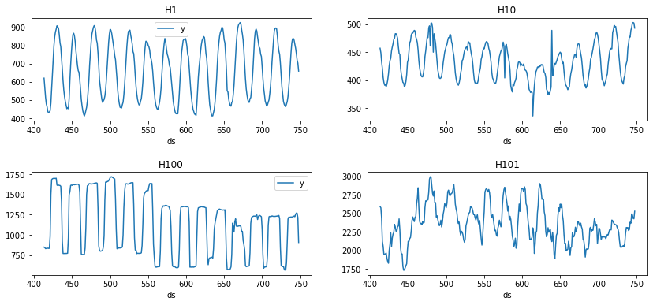
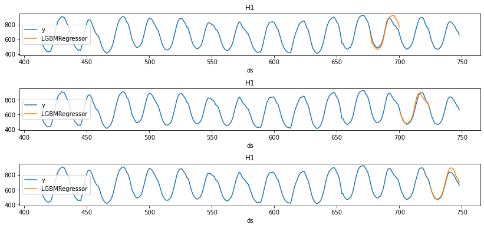

export const quartoRawHtml =
[`<div>
<style scoped>
    .dataframe tbody tr th:only-of-type {
        vertical-align: middle;
    }
    .dataframe tbody tr th {
        vertical-align: top;
    }
    .dataframe thead th {
        text-align: right;
    }
</style>
`,`
</div>`,`<div>
<style scoped>
    .dataframe tbody tr th:only-of-type {
        vertical-align: middle;
    }
    .dataframe tbody tr th {
        vertical-align: top;
    }
    .dataframe thead th {
        text-align: right;
    }
</style>
`,`
</div>`];

> In this example, we’ll implement time series cross-validation to
> evaluate model’s performance.

:::warning

## Prerequesites

This tutorial assumes basic familiarity with `MLForecast`. For a minimal
example visit the [Quick
Start](https://nixtla.github.io/mlforecast/docs/quick_start_local.html)

:::

## Introduction {#introduction}

Time series cross-validation is a method for evaluating how a model
would have performed in the past. It works by defining a sliding window
across the historical data and predicting the period following it.


[MLForecast](https://nixtla.github.io/mlforecast/) has an implementation
of time series cross-validation that is fast and easy to use. This
implementation makes cross-validation a efficient operation, which makes
it less time-consuming. In this notebook, we’ll use it on a subset of
the [M4
Competition](https://www.sciencedirect.com/science/article/pii/S0169207019301128)
hourly dataset.

**Outline:**

1.  Install libraries
2.  Load and explore data
3.  Train model
4.  Perform time series cross-validation
5.  Evaluate results

:::tip

You can use Colab to run this Notebook interactively
<a href="https://colab.research.google.com/github/Nixtla/mlforecast/blob/main/nbs/docs/cross_validation.ipynb" target="_parent"></a>

:::

## Install libraries {#install-libraries}

We assume that you have `MLForecast` already installed. If not, check
this guide for instructions on [how to install
MLForecast](https://nixtla.github.io/mlforecast/docs/install.html).

Install the necessary packages with `pip install mlforecast`.

<details>
<summary>Code</summary>

``` python
%%capture
pip install mlforecast lightgbm
```

</details>
<details>
<summary>Code</summary>

``` python
from mlforecast import MLForecast # required to instantiate MLForecast object and use cross-validation method 
```

</details>

## Load and explore the data {#load-and-explore-the-data}

As stated in the introduction, we’ll use the M4 Competition hourly
dataset. We’ll first import the data from an URL using `pandas`.

<details>
<summary>Code</summary>

``` python
import pandas as pd 

Y_df = pd.read_csv('https://datasets-nixtla.s3.amazonaws.com/m4-hourly.csv') # load the data 
Y_df.head() 
```

</details>
<div dangerouslySetInnerHTML={{ __html: quartoRawHtml[0] }} />

|     | unique_id | ds  | y     |
|-----|-----------|-----|-------|
| 0   | H1        | 1   | 605.0 |
| 1   | H1        | 2   | 586.0 |
| 2   | H1        | 3   | 586.0 |
| 3   | H1        | 4   | 559.0 |
| 4   | H1        | 5   | 511.0 |

<div dangerouslySetInnerHTML={{ __html: quartoRawHtml[1] }} />

The input to `MLForecast` is a data frame in [long
format](https://www.theanalysisfactor.com/wide-and-long-data/) with
three columns: `unique_id`, `ds` and `y`:

-   The `unique_id` (string, int, or category) represents an identifier
    for the series.
-   The `ds` (datestamp or int) column should be either an integer
    indexing time or a datestamp in format YYYY-MM-DD or YYYY-MM-DD
    HH:MM:SS.
-   The `y` (numeric) represents the measurement we wish to forecast.

The data in this example already has this format, so no changes are
needed.

We can plot the time series we’ll work with using the following
function.

<details>
<summary>Code</summary>

``` python
import matplotlib.pyplot as plt

def plot(df, fname, last_n=24 * 14):
    fig, ax = plt.subplots(nrows=2, ncols=2, figsize=(14, 6), gridspec_kw=dict(hspace=0.5))
    uids = df['unique_id'].unique()
    for i, (uid, axi) in enumerate(zip(uids, ax.flat)):
        legend = i % 2 == 0
        df[df['unique_id'].eq(uid)].tail(last_n).set_index('ds').plot(ax=axi, title=uid, legend=legend)
    fig.savefig(fname, bbox_inches='tight')
    plt.close()
```

</details>
<details>
<summary>Code</summary>

``` python
plot(Y_df, '../figs/cross_validation__series.png')
```

</details>



## Train model {#train-model}

For this example, we’ll use LightGBM. We first need to import it and
then we need to instantiate a new `MLForecast` object.

The `MLForecast` object has the following parameters:

-   `models`: a list of sklearn-like (`fit` and `predict`) models.
-   `freq`: a string indicating the frequency of the data. See [panda’s
    available
    frequencies.](https://pandas.pydata.org/pandas-docs/stable/user_guide/timeseries.html#offset-aliases)
-   `target_transforms`: Transformations to apply to the target before
    computing the features. These are restored at the forecasting step.
-   `lags`: Lags of the target to use as features.

In this example, we are only using `differences` and `lags` to produce
features. See [the full
documentation](https://nixtla.github.io/mlforecast/forecast.html) to see
all available features.

Any settings are passed into the constructor. Then you call its `fit`
method and pass in the historical data frame `df`.

<details>
<summary>Code</summary>

``` python
import lightgbm as lgb
from mlforecast.target_transforms import Differences

models = [lgb.LGBMRegressor()]

mlf = MLForecast(
    models = models, 
    freq = 1,# our series have integer timestamps, so we'll just add 1 in every timeste, 
    target_transforms=[Differences([24])],
    lags=range(1, 25, 1)
)
```

</details>

## Perform time series cross-validation {#perform-time-series-cross-validation}

Once the `MLForecast` object has been instantiated, we can use the
`cross_validation` method, which takes the following arguments:

-   `data`: training data frame with `MLForecast` format
-   `window_size` (int): represents the h steps into the future that
    will be forecasted
-   `n_windows` (int): number of windows used for cross-validation,
    meaning the number of forecasting processes in the past you want to
    evaluate.
-   `id_col`: identifies each time series.
-   `time_col`: indetifies the temporal column of the time series.
-   `target_col`: identifies the column to model.

For this particular example, we’ll use 3 windows of 24 hours.

<details>
<summary>Code</summary>

``` python
crossvalidation_df = mlf.cross_validation(
    data=Y_df,
    window_size=24,
    n_windows=3,
)
```

</details>

The crossvaldation_df object is a new data frame that includes the
following columns:

-   `unique_id`: identifies each time series.
-   `ds`: datestamp or temporal index.
-   `cutoff`: the last datestamp or temporal index for the `n_windows`.
-   `y`: true value
-   `"model"`: columns with the model’s name and fitted value.

<details>
<summary>Code</summary>

``` python
crossvalidation_df.head()
```

</details>
<div dangerouslySetInnerHTML={{ __html: quartoRawHtml[2] }} />

|     | unique_id | ds  | cutoff | y     | LGBMRegressor |
|-----|-----------|-----|--------|-------|---------------|
| 0   | H1        | 677 | 676    | 691.0 | 673.703191    |
| 1   | H1        | 678 | 676    | 618.0 | 552.306270    |
| 2   | H1        | 679 | 676    | 563.0 | 541.778027    |
| 3   | H1        | 680 | 676    | 529.0 | 502.778027    |
| 4   | H1        | 681 | 676    | 504.0 | 480.778027    |

<div dangerouslySetInnerHTML={{ __html: quartoRawHtml[3] }} />

We’ll now plot the forecast for each cutoff period.

<details>
<summary>Code</summary>

``` python
def plot_cv(df, df_cv, uid, fname, last_n=24 * 14):
    cutoffs = df_cv.query('unique_id == @uid')['cutoff'].unique()
    fig, ax = plt.subplots(nrows=len(cutoffs), ncols=1, figsize=(14, 6), gridspec_kw=dict(hspace=0.8))
    for cutoff, axi in zip(cutoffs, ax.flat):
        df.query('unique_id == @uid').tail(last_n).set_index('ds').plot(ax=axi, title=uid, y='y')
        df_cv.query('unique_id == @uid & cutoff == @cutoff').set_index('ds').plot(ax=axi, title=uid, y='LGBMRegressor')
    fig.savefig(fname, bbox_inches='tight')
    plt.close()
```

</details>
<details>
<summary>Code</summary>

``` python
plot_cv(Y_df, crossvalidation_df, 'H1', '../figs/cross_validation__predictions.png')
```

</details>



Notice that in each cutoff period, we generated a forecast for the next
24 hours using only the data `y` before said period.

## Evaluate results {#evaluate-results}

We can now compute the accuracy of the forecast using an appropiate
accuracy metric. Here we’ll use the [Root Mean Squared Error
(RMSE).](https://en.wikipedia.org/wiki/Root-mean-square_deviation) To do
this, we first need to install
[datasetsforecast](https://github.com/Nixtla/datasetsforecast/tree/main/),
a Python library developed by Nixtla that includes a function to compute
the RMSE.

<details>
<summary>Code</summary>

``` python
%%capture
pip install datasetsforecast
```

</details>
<details>
<summary>Code</summary>

``` python
from datasetsforecast.losses import rmse  
```

</details>

The function to compute the RMSE takes two arguments:

1.  The actual values.  
2.  The forecasts, in this case, `LGBMRegressor`.

In this case we will compute the `rmse` per time series and cutoff and
then we will take the mean of the results.

<details>
<summary>Code</summary>

``` python
cv_rmse = crossvalidation_df.groupby(['unique_id', 'cutoff']).apply(lambda df: rmse(df['y'], df['LGBMRegressor'])).mean()
print("RMSE using cross-validation: ", cv_rmse)
```

</details>

``` text
RMSE using cross-validation:  249.90517171185527
```

This measure should better reflect the predictive abilities of our
model, since it used different time periods to test its accuracy.

## References {#references}

[Rob J. Hyndman and George Athanasopoulos (2018). “Forecasting
principles and practice, Time series
cross-validation”](https://otexts.com/fpp3/tscv.html).

