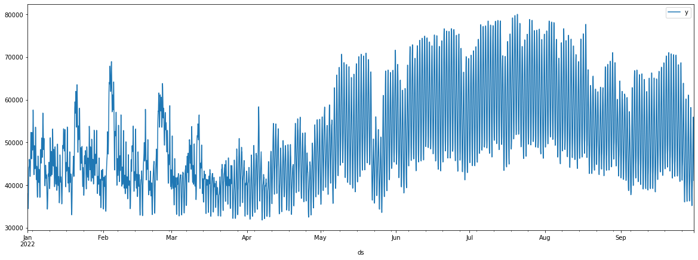
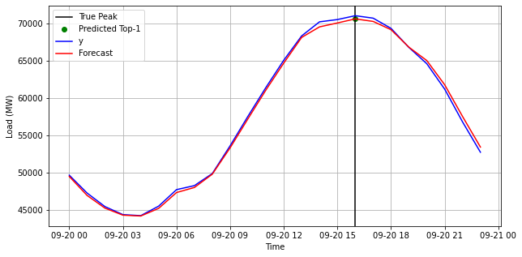

export const quartoRawHtml =
[`<div>
<style scoped>
    .dataframe tbody tr th:only-of-type {
        vertical-align: middle;
    }
    .dataframe tbody tr th {
        vertical-align: top;
    }
    .dataframe thead th {
        text-align: right;
    }
</style>
`,`
</div>`];

> In this example we will show how to perform electricity load
> forecasting on the ERCOT (Texas) market for detecting daily peaks.

## Introduction {#introduction}

Predicting peaks in different markets is useful. In the electricity
market, consuming electricity at peak demand is penalized with higher
tarifs. When an individual or company consumes electricity when its most
demanded, regulators calls that a coincident peak (CP).

In the Texas electricity market (ERCOT), the peak is the monthly
15-minute interval when the ERCOT Grid is at a point of highest
capacity. The peak is caused by all consumers’ combined demand on the
electrical grid. The coincident peak demand is an important factor used
by ERCOT to determine final electricity consumption bills. ERCOT
registers the CP demand of each client for 4 months, between June and
September, and uses this to adjust electricity prices. Clients can
therefore save on electricity bills by reducing the coincident peak
demand.

In this example we will train a `LightGBM` model on historic load data
to forecast day-ahead peaks on September 2022. Multiple seasonality is
traditionally present in low sampled electricity data. Demand exhibits
daily and weekly seasonality, with clear patterns for specific hours of
the day such as 6:00pm vs 3:00am or for specific days such as Sunday vs
Friday.

First, we will load ERCOT historic demand, then we will use the
`MLForecast.cross_validation` method to fit the `LightGBM` model and
forecast daily load during September. Finally, we show how to use the
forecasts to detect the coincident peak.

**Outline**

1.  Install libraries
2.  Load and explore the data
3.  Fit LightGBM model and forecast
4.  Peak detection

:::tip

You can use Colab to run this Notebook interactively
<a href="https://colab.research.google.com/github/Nixtla/mlforecast/blob/main/nbs/examples/electricity_peak_forecasting.ipynb" target="_parent"></a>

:::

## Libraries {#libraries}

We assume you have MLForecast already installed. Check this guide for
instructions on [how to install MLForecast](./install.ipynb).

Install the necessary packages using `pip install mlforecast`.

Also we have to install `LightGBM` using `pip install lightgbm`.

## Load Data {#load-data}

The input to MLForecast is always a data frame in [long
format](https://www.theanalysisfactor.com/wide-and-long-data/) with
three columns: `unique_id`, `ds` and `y`:

-   The `unique_id` (string, int or category) represents an identifier
    for the series.

-   The `ds` (datestamp or int) column should be either an integer
    indexing time or a datestamp ideally like YYYY-MM-DD for a date or
    YYYY-MM-DD HH:MM:SS for a timestamp.

-   The `y` (numeric) represents the measurement we wish to forecast. We
    will rename the

First, read the 2022 historic total demand of the ERCOT market. We
processed the original data (available
[here](https://www.ercot.com/gridinfo/load/load_hist)), by adding the
missing hour due to daylight saving time, parsing the date to datetime
format, and filtering columns of interest.

<details>
<summary>Code</summary>

``` python
import numpy as np
import pandas as pd
```

</details>
<details>
<summary>Code</summary>

``` python
# Load data
Y_df = pd.read_csv('https://datasets-nixtla.s3.amazonaws.com/ERCOT-clean.csv', parse_dates=['ds'])
Y_df = Y_df.query("ds >= '2022-01-01' & ds <= '2022-10-01'")
```

</details>
<details>
<summary>Code</summary>

``` python
Y_df.plot(x='ds', y='y', figsize=(20, 7))
```

</details>

``` text
<AxesSubplot: xlabel='ds'>
```



We observe that the time series exhibits seasonal patterns. Moreover,
the time series contains `6,552` observations, so it is necessary to use
computationally efficient methods to deploy them in production.

## Fit and Forecast LighGBM model {#fit-and-forecast-lighgbm-model}

Import the `MLForecast` class and the models you need.

<details>
<summary>Code</summary>

``` python
import lightgbm as lgb

from mlforecast import MLForecast
from mlforecast.target_transforms import Differences
```

</details>

First, instantiate the model and define the parameters.

:::tip

In this example we are using the default parameters of the
`lgb.LGBMRegressor` model, but you can change them to improve the
forecasting performance.

:::

<details>
<summary>Code</summary>

``` python
models = [
    lgb.LGBMRegressor() # you can include more models here
]
```

</details>

We fit the model by instantiating a `MLForecast` object with the
following required parameters:

-   `models`: a list of sklearn-like (fit and predict) models.

-   `freq`: a string indicating the frequency of the data. (See [panda’s
    available
    frequencies](https://pandas.pydata.org/pandas-docs/stable/user_guide/timeseries.html#offset-aliases).)

-   `target_transforms`: Transformations to apply to the target before
    computing the features. These are restored at the forecasting step.

-   `lags`: Lags of the target to use as features.

<details>
<summary>Code</summary>

``` python
# Instantiate MLForecast class as mlf
mlf = MLForecast(
    models=models,
    freq='H', 
    target_transforms=[Differences([24])],
    lags=range(1, 25)
)
```

</details>

:::tip

In this example, we are only using differences and lags to produce
features. See the [full
documentation](https://nixtla.github.io/mlforecast/forecast.html#mlforecast)
to see all available features.

:::

The `cross_validation` method allows the user to simulate multiple
historic forecasts, greatly simplifying pipelines by replacing for loops
with `fit` and `predict` methods. This method re-trains the model and
forecast each window. See [this
tutorial](https://nixtla.github.io/statsforecast/examples/getting_started_complete.html)
for an animation of how the windows are defined.

Use the `cross_validation` method to produce all the daily forecasts for
September. To produce daily forecasts set the forecasting horizon
`window_size` as 24. In this example we are simulating deploying the
pipeline during September, so set the number of windows as 30 (one for
each day). Finally, the step size between windows is 24 (equal to the
`window_size`). This ensure to only produce one forecast per day.

Additionally,

-   `id_col`: identifies each time series.
-   `time_col`: indetifies the temporal column of the time series.
-   `target_col`: identifies the column to model.

<details>
<summary>Code</summary>

``` python
crossvalidation_df = mlf.cross_validation(
    data=Y_df,
    window_size=24,
    n_windows=30,
)
```

</details>
<details>
<summary>Code</summary>

``` python
crossvalidation_df.head()
```

</details>
<div dangerouslySetInnerHTML={{ __html: quartoRawHtml[0] }} />

|     | unique_id | ds                  | cutoff              | y            | LGBMRegressor |
|-----|-----------|---------------------|---------------------|--------------|---------------|
| 0   | ERCOT     | 2022-09-01 00:00:00 | 2022-08-31 23:00:00 | 45482.471757 | 45685.265537  |
| 1   | ERCOT     | 2022-09-01 01:00:00 | 2022-08-31 23:00:00 | 43602.658043 | 43779.819515  |
| 2   | ERCOT     | 2022-09-01 02:00:00 | 2022-08-31 23:00:00 | 42284.817342 | 42672.470923  |
| 3   | ERCOT     | 2022-09-01 03:00:00 | 2022-08-31 23:00:00 | 41663.156771 | 42091.768192  |
| 4   | ERCOT     | 2022-09-01 04:00:00 | 2022-08-31 23:00:00 | 41710.621904 | 42481.403168  |

<div dangerouslySetInnerHTML={{ __html: quartoRawHtml[1] }} />


:::important

When using `cross_validation` make sure the forecasts are produced at
the desired timestamps. Check the `cutoff` column which specifices the
last timestamp before the forecasting window.

:::

## Peak Detection {#peak-detection}

Finally, we use the forecasts in `crossvaldation_df` to detect the daily
hourly demand peaks. For each day, we set the detected peaks as the
highest forecasts. In this case, we want to predict one peak (`npeaks`);
depending on your setting and goals, this parameter might change. For
example, the number of peaks can correspond to how many hours a battery
can be discharged to reduce demand.

<details>
<summary>Code</summary>

``` python
npeaks = 1 # Number of peaks
```

</details>

For the ERCOT 4CP detection task we are interested in correctly
predicting the highest monthly load. Next, we filter the day in
September with the highest hourly demand and predict the peak.

<details>
<summary>Code</summary>

``` python
crossvalidation_df = crossvalidation_df.reset_index()[['ds','y','LGBMRegressor']]
max_day = crossvalidation_df.iloc[crossvalidation_df['y'].argmax()].ds.day # Day with maximum load
cv_df_day = crossvalidation_df.query('ds.dt.day == @max_day')
max_hour = cv_df_day['y'].argmax()
peaks = cv_df_day['LGBMRegressor'].argsort().iloc[-npeaks:].values # Predicted peaks
```

</details>

In the following plot we see how the LightGBM model is able to correctly
detect the coincident peak for September 2022.

<details>
<summary>Code</summary>

``` python
import matplotlib.pyplot as plt
```

</details>
<details>
<summary>Code</summary>

``` python
fig, ax = plt.subplots(figsize=(10, 5))
ax.axvline(cv_df_day.iloc[max_hour]['ds'], color='black', label='True Peak')
ax.scatter(cv_df_day.iloc[peaks]['ds'], cv_df_day.iloc[peaks]['LGBMRegressor'], color='green', label=f'Predicted Top-{npeaks}')
ax.plot(cv_df_day['ds'], cv_df_day['y'], label='y', color='blue')
ax.plot(cv_df_day['ds'], cv_df_day['LGBMRegressor'], label='Forecast', color='red')
ax.set(xlabel='Time', ylabel='Load (MW)')
ax.grid()
ax.legend()
fig.savefig('../figs/electricity_peak_forecasting__predicted_peak.png', bbox_inches='tight')
plt.close()
```

</details>



:::important

In this example we only include September. However, MLForecast and
LightGBM can correctly predict the peaks for the 4 months of 2022. You
can try this by increasing the `n_windows` parameter of
`cross_validation` or filtering the `Y_df` dataset.

:::

## Next steps {#next-steps}

MLForecast and LightGBM in particular are good benchmarking models for
peak detection. However, it might be useful to explore further and newer
forecasting algorithms or perform hyperparameter optimization.

