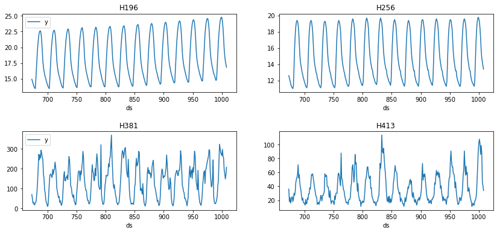
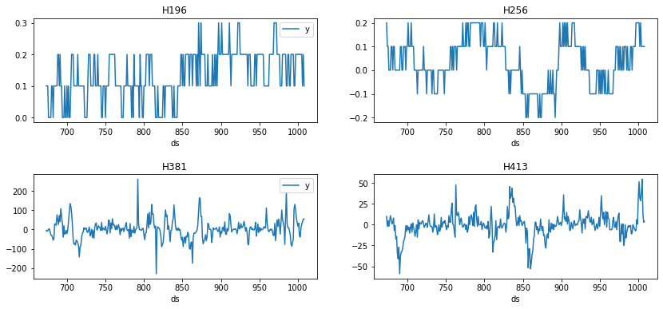
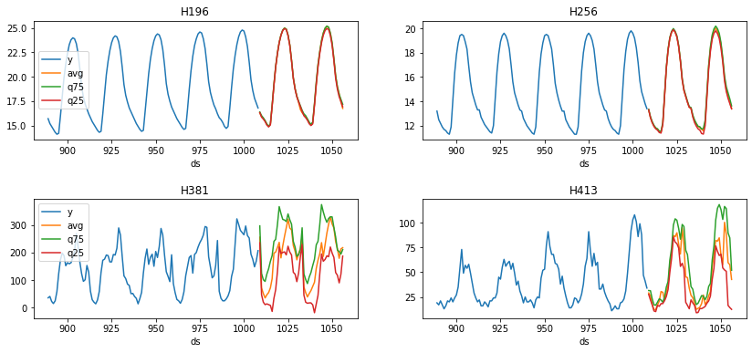
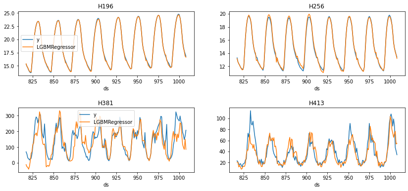
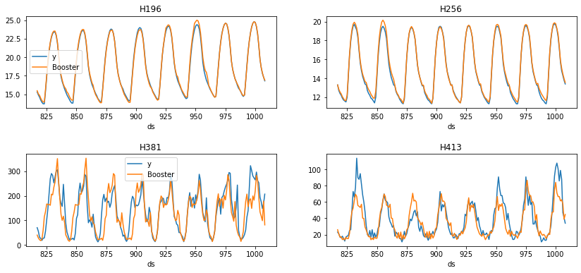
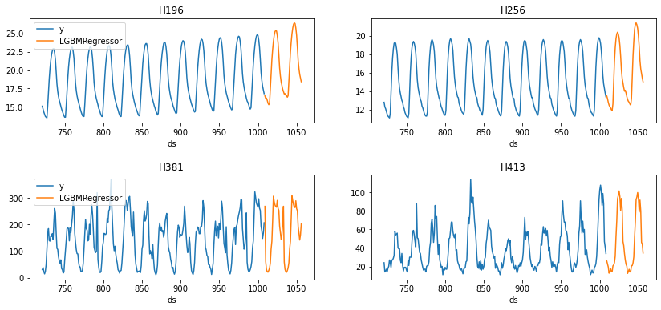

export const quartoRawHtml =
[`<div>
<style scoped>
    .dataframe tbody tr th:only-of-type {
        vertical-align: middle;
    }
    .dataframe tbody tr th {
        vertical-align: top;
    }
    .dataframe thead th {
        text-align: right;
    }
</style>
`,`
<p>4032 rows × 3 columns</p>
</div>`,`<div>
<style scoped>
    .dataframe tbody tr th:only-of-type {
        vertical-align: middle;
    }
    .dataframe tbody tr th {
        vertical-align: top;
    }
    .dataframe thead th {
        text-align: right;
    }
</style>
`,`
<p>3936 rows × 3 columns</p>
</div>`,`<div>
<style scoped>
    .dataframe tbody tr th:only-of-type {
        vertical-align: middle;
    }
    .dataframe tbody tr th {
        vertical-align: top;
    }
    .dataframe thead th {
        text-align: right;
    }
</style>
`,`
<p>3840 rows × 5 columns</p>
</div>`,`<div>
<style scoped>
    .dataframe tbody tr th:only-of-type {
        vertical-align: middle;
    }
    .dataframe tbody tr th {
        vertical-align: top;
    }
    .dataframe thead th {
        text-align: right;
    }
</style>
`,`
<p>3652 rows × 6 columns</p>
</div>`,`<div>
<style scoped>
    .dataframe tbody tr th:only-of-type {
        vertical-align: middle;
    }
    .dataframe tbody tr th {
        vertical-align: top;
    }
    .dataframe thead th {
        text-align: right;
    }
</style>
`,`
<p>3936 rows × 4 columns</p>
</div>`,`<div>
<style scoped>
    .dataframe tbody tr th:only-of-type {
        vertical-align: middle;
    }
    .dataframe tbody tr th {
        vertical-align: top;
    }
    .dataframe thead th {
        text-align: right;
    }
</style>
`,`
<p>4028 rows × 4 columns</p>
</div>`,`<div>
<style scoped>
    .dataframe tbody tr th:only-of-type {
        vertical-align: middle;
    }
    .dataframe tbody tr th {
        vertical-align: top;
    }
    .dataframe thead th {
        text-align: right;
    }
</style>
`,`
</div>`,`<div>
<style scoped>
    .dataframe tbody tr th:only-of-type {
        vertical-align: middle;
    }
    .dataframe tbody tr th {
        vertical-align: top;
    }
    .dataframe thead th {
        text-align: right;
    }
</style>
`,`
</div>`,`<div>
<style scoped>
    .dataframe tbody tr th:only-of-type {
        vertical-align: middle;
    }
    .dataframe tbody tr th {
        vertical-align: top;
    }
    .dataframe thead th {
        text-align: right;
    }
</style>
`,`
<p>192 rows × 5 columns</p>
</div>`,`<div>
<style scoped>
    .dataframe tbody tr th:only-of-type {
        vertical-align: middle;
    }
    .dataframe tbody tr th {
        vertical-align: top;
    }
    .dataframe thead th {
        text-align: right;
    }
</style>
`,`
</div>`,`<div>
<style scoped>
    .dataframe tbody tr th:only-of-type {
        vertical-align: middle;
    }
    .dataframe tbody tr th {
        vertical-align: top;
    }
    .dataframe thead th {
        text-align: right;
    }
</style>
`,`
</div>`,`<div>
<style scoped>
    .dataframe tbody tr th:only-of-type {
        vertical-align: middle;
    }
    .dataframe tbody tr th {
        vertical-align: top;
    }
    .dataframe thead th {
        text-align: right;
    }
</style>
`,`
<p>768 rows × 5 columns</p>
</div>`,`<div>
<style scoped>
    .dataframe tbody tr th:only-of-type {
        vertical-align: middle;
    }
    .dataframe tbody tr th {
        vertical-align: top;
    }
    .dataframe thead th {
        text-align: right;
    }
</style>
`,`
<p>768 rows × 5 columns</p>
</div>`];

::: {.cell 0=‘h’ 1=‘i’ 2=‘d’ 3=‘e’}

<details>
<summary>Code</summary>

``` python
%load_ext autoreload
%autoreload 2
import os
os.chdir('..')
```

</details>

:::

> Detailed description of all the functionalities that MLForecast
> provides.

## Data setup {#data-setup}

For this example we’ll use a subset of the M4 hourly dataset. You can
find the a notebook with the full dataset
[here](https://www.kaggle.com/code/lemuz90/m4-competition).

<details>
<summary>Code</summary>

``` python
import random

import pandas as pd
from datasetsforecast.m4 import M4
```

</details>
<details>
<summary>Code</summary>

``` python
await M4.async_download('data', group='Hourly')
df, *_ = M4.load('data', 'Hourly')
uids = df['unique_id'].unique()
random.seed(0)
sample_uids = random.choices(uids, k=4)
df = df[df['unique_id'].isin(sample_uids)].reset_index(drop=True)
df['ds'] = df['ds'].astype('int64')
df
```

</details>
<div dangerouslySetInnerHTML={{ __html: quartoRawHtml[0] }} />

|      | unique_id | ds   | y    |
|------|-----------|------|------|
| 0    | H196      | 1    | 11.8 |
| 1    | H196      | 2    | 11.4 |
| 2    | H196      | 3    | 11.1 |
| 3    | H196      | 4    | 10.8 |
| 4    | H196      | 5    | 10.6 |
| ...  | ...       | ...  | ...  |
| 4027 | H413      | 1004 | 99.0 |
| 4028 | H413      | 1005 | 88.0 |
| 4029 | H413      | 1006 | 47.0 |
| 4030 | H413      | 1007 | 41.0 |
| 4031 | H413      | 1008 | 34.0 |

<div dangerouslySetInnerHTML={{ __html: quartoRawHtml[1] }} />

## EDA {#eda}

We’ll take a look at our series to get ideas for transformations and
features.

<details>
<summary>Code</summary>

``` python
import matplotlib.pyplot as plt

def plot(df, fname, last_n=24 * 14):
    fig, ax = plt.subplots(nrows=2, ncols=2, figsize=(14, 6), gridspec_kw=dict(hspace=0.5))
    uids = df['unique_id'].unique()
    for i, (uid, axi) in enumerate(zip(uids, ax.flat)):
        legend = i % 2 == 0
        df[df['unique_id'].eq(uid)].tail(last_n).set_index('ds').plot(ax=axi, title=uid, legend=legend)
    fig.savefig(fname, bbox_inches='tight')
    plt.close()
```

</details>
<details>
<summary>Code</summary>

``` python
plot(df, 'figs/end_to_end_walkthrough__eda.png')
```

</details>



We can use the `MLForecast.preprocess` method to explore different
transformations. It looks like these series have a strong seasonality on
the hour of the day, so we can subtract the value from the same hour in
the previous day to remove it. This can be done with the
`mlforecast.target_transforms.Differences` transformer, which we pass
through `target_transforms`.

<details>
<summary>Code</summary>

``` python
from mlforecast import MLForecast
from mlforecast.target_transforms import Differences
```

</details>
<details>
<summary>Code</summary>

``` python
fcst = MLForecast(
    models=[],  # we're not interested in modeling yet
    freq=1,  # our series have integer timestamps, so we'll just add 1 in every timestep
    target_transforms=[Differences([24])],
)
prep = fcst.preprocess(df)
prep
```

</details>
<div dangerouslySetInnerHTML={{ __html: quartoRawHtml[2] }} />

|      | unique_id | ds   | y    |
|------|-----------|------|------|
| 24   | H196      | 25   | 0.3  |
| 25   | H196      | 26   | 0.3  |
| 26   | H196      | 27   | 0.1  |
| 27   | H196      | 28   | 0.2  |
| 28   | H196      | 29   | 0.2  |
| ...  | ...       | ...  | ...  |
| 4027 | H413      | 1004 | 39.0 |
| 4028 | H413      | 1005 | 55.0 |
| 4029 | H413      | 1006 | 14.0 |
| 4030 | H413      | 1007 | 3.0  |
| 4031 | H413      | 1008 | 4.0  |

<div dangerouslySetInnerHTML={{ __html: quartoRawHtml[3] }} />

This has subtacted the lag 24 from each value, we can see what our
series look like now.

<details>
<summary>Code</summary>

``` python
plot(prep, 'figs/end_to_end_walkthrough__differences.png')
```

</details>



## Adding features {#adding-features}

### Lags {#lags}

Looks like the seasonality is gone, we can now try adding some lag
features.

<details>
<summary>Code</summary>

``` python
fcst = MLForecast(
    models=[],
    freq=1,
    lags=[1, 24],
    target_transforms=[Differences([24])],    
)
prep = fcst.preprocess(df)
prep
```

</details>
<div dangerouslySetInnerHTML={{ __html: quartoRawHtml[4] }} />

|      | unique_id | ds   | y    | lag1 | lag24 |
|------|-----------|------|------|------|-------|
| 48   | H196      | 49   | 0.1  | 0.1  | 0.3   |
| 49   | H196      | 50   | 0.1  | 0.1  | 0.3   |
| 50   | H196      | 51   | 0.2  | 0.1  | 0.1   |
| 51   | H196      | 52   | 0.1  | 0.2  | 0.2   |
| 52   | H196      | 53   | 0.1  | 0.1  | 0.2   |
| ...  | ...       | ...  | ...  | ...  | ...   |
| 4027 | H413      | 1004 | 39.0 | 29.0 | 1.0   |
| 4028 | H413      | 1005 | 55.0 | 39.0 | -25.0 |
| 4029 | H413      | 1006 | 14.0 | 55.0 | -20.0 |
| 4030 | H413      | 1007 | 3.0  | 14.0 | 0.0   |
| 4031 | H413      | 1008 | 4.0  | 3.0  | -16.0 |

<div dangerouslySetInnerHTML={{ __html: quartoRawHtml[5] }} />

<details>
<summary>Code</summary>

``` python
prep.drop(columns=['unique_id', 'ds']).corr()['y']
```

</details>

``` text
y        1.000000
lag1     0.622531
lag24   -0.234268
Name: y, dtype: float64
```

### Lag transforms {#lag-transforms}

Lag transforms are defined as a dictionary where the keys are the lags
and the values are lists of functions that transform an array. These
must be [numba](http://numba.pydata.org/) jitted functions (so that
computing the features doesn’t become a bottleneck). There are some
implemented in the [window-ops
package](https://github.com/jmoralez/window_ops) but you can also
implement your own.

If the function takes two or more arguments you can either:

-   supply a tuple (tfm_func, arg1, arg2, …)
-   define a new function fixing the arguments

<details>
<summary>Code</summary>

``` python
from numba import njit
from window_ops.expanding import expanding_mean
from window_ops.rolling import rolling_mean
```

</details>
<details>
<summary>Code</summary>

``` python
@njit
def rolling_mean_48(x):
    return rolling_mean(x, window_size=48)


fcst = MLForecast(
    models=[],
    freq=1,
    target_transforms=[Differences([24])],    
    lag_transforms={
        1: [expanding_mean],
        24: [(rolling_mean, 48), rolling_mean_48],
    },
)
prep = fcst.preprocess(df)
prep
```

</details>
<div dangerouslySetInnerHTML={{ __html: quartoRawHtml[6] }} />

|      | unique_id | ds   | y    | expanding_mean_lag1 | rolling_mean_lag24_window_size48 | rolling_mean_48_lag24 |
|------|-----------|------|------|---------------------|----------------------------------|-----------------------|
| 95   | H196      | 96   | 0.1  | 0.174648            | 0.150000                         | 0.150000              |
| 96   | H196      | 97   | 0.3  | 0.173611            | 0.145833                         | 0.145833              |
| 97   | H196      | 98   | 0.3  | 0.175342            | 0.141667                         | 0.141667              |
| 98   | H196      | 99   | 0.3  | 0.177027            | 0.141667                         | 0.141667              |
| 99   | H196      | 100  | 0.3  | 0.178667            | 0.141667                         | 0.141667              |
| ...  | ...       | ...  | ...  | ...                 | ...                              | ...                   |
| 4027 | H413      | 1004 | 39.0 | 0.242084            | 3.437500                         | 3.437500              |
| 4028 | H413      | 1005 | 55.0 | 0.281633            | 2.708333                         | 2.708333              |
| 4029 | H413      | 1006 | 14.0 | 0.337411            | 2.125000                         | 2.125000              |
| 4030 | H413      | 1007 | 3.0  | 0.351324            | 1.770833                         | 1.770833              |
| 4031 | H413      | 1008 | 4.0  | 0.354018            | 1.208333                         | 1.208333              |

<div dangerouslySetInnerHTML={{ __html: quartoRawHtml[7] }} />

You can see that both approaches get to the same result, you can use
whichever one you feel most comfortable with.

### Date features {#date-features}

If your time column is made of timestamps then it might make sense to
extract features like week, dayofweek, quarter, etc. You can do that by
passing a list of strings with [pandas time/date
components](https://pandas.pydata.org/docs/user_guide/timeseries.html#time-date-components).
You can also pass functions that will take the time column as input, as
we’ll show here.

<details>
<summary>Code</summary>

``` python
def hour_index(times):
    return times % 24

fcst = MLForecast(
    models=[],
    freq=1,
    target_transforms=[Differences([24])],
    date_features=[hour_index],
)
fcst.preprocess(df)
```

</details>
<div dangerouslySetInnerHTML={{ __html: quartoRawHtml[8] }} />

|      | unique_id | ds   | y    | hour_index |
|------|-----------|------|------|------------|
| 24   | H196      | 25   | 0.3  | 1          |
| 25   | H196      | 26   | 0.3  | 2          |
| 26   | H196      | 27   | 0.1  | 3          |
| 27   | H196      | 28   | 0.2  | 4          |
| 28   | H196      | 29   | 0.2  | 5          |
| ...  | ...       | ...  | ...  | ...        |
| 4027 | H413      | 1004 | 39.0 | 20         |
| 4028 | H413      | 1005 | 55.0 | 21         |
| 4029 | H413      | 1006 | 14.0 | 22         |
| 4030 | H413      | 1007 | 3.0  | 23         |
| 4031 | H413      | 1008 | 4.0  | 0          |

<div dangerouslySetInnerHTML={{ __html: quartoRawHtml[9] }} />

### Target transformations {#target-transformations}

If you want to do some transformation to your target before computing
the features and then re-apply it after predicting you can use the
`target_transforms` argument, which takes a list of transformations like
the following:

<details>
<summary>Code</summary>

``` python
from mlforecast.target_transforms import BaseTargetTransform

class StandardScaler(BaseTargetTransform):
    """Standardizes the series by subtracting their mean and dividing by their standard deviation."""
    def fit_transform(self, df: pd.DataFrame) -> pd.DataFrame:
        self.norm_ = df.groupby(self.id_col)[self.target_col].agg(['mean', 'std'])
        df = df.merge(self.norm_, on=self.id_col)
        df[self.target_col] = (df[self.target_col] - df['mean']) / df['std']
        df = df.drop(columns=['mean', 'std'])
        return df

    def inverse_transform(self, df: pd.DataFrame) -> pd.DataFrame:
        df = df.merge(self.norm_, on=self.id_col)
        for col in df.columns.drop([self.id_col, self.time_col, 'mean', 'std']):
            df[col] = df[col] * df['std'] + df['mean']
        df = df.drop(columns=['std', 'mean'])
        return df
```

</details>
<details>
<summary>Code</summary>

``` python
fcst = MLForecast(
    models=[],
    freq=1,
    lags=[1],
    target_transforms=[StandardScaler()]
)
fcst.preprocess(df)
```

</details>
<div dangerouslySetInnerHTML={{ __html: quartoRawHtml[10] }} />

|      | unique_id | ds   | y         | lag1      |
|------|-----------|------|-----------|-----------|
| 1    | H196      | 2    | -1.492285 | -1.382600 |
| 2    | H196      | 3    | -1.574549 | -1.492285 |
| 3    | H196      | 4    | -1.656813 | -1.574549 |
| 4    | H196      | 5    | -1.711656 | -1.656813 |
| 5    | H196      | 6    | -1.793919 | -1.711656 |
| ...  | ...       | ...  | ...       | ...       |
| 4027 | H413      | 1004 | 3.061246  | 2.423809  |
| 4028 | H413      | 1005 | 2.521876  | 3.061246  |
| 4029 | H413      | 1006 | 0.511497  | 2.521876  |
| 4030 | H413      | 1007 | 0.217295  | 0.511497  |
| 4031 | H413      | 1008 | -0.125941 | 0.217295  |

<div dangerouslySetInnerHTML={{ __html: quartoRawHtml[11] }} />

We can define a naive model to test this

<details>
<summary>Code</summary>

``` python
from sklearn.base import BaseEstimator

class Naive(BaseEstimator):
    def fit(self, X, y):
        return self

    def predict(self, X):
        return X['lag1']
```

</details>
<details>
<summary>Code</summary>

``` python
fcst = MLForecast(
    models=[Naive()],
    freq=1,
    lags=[1],
    target_transforms=[StandardScaler()]
)
fcst.fit(df)
preds = fcst.predict(1)
preds
```

</details>
<div dangerouslySetInnerHTML={{ __html: quartoRawHtml[12] }} />

|     | unique_id | ds   | Naive |
|-----|-----------|------|-------|
| 0   | H196      | 1009 | 16.8  |
| 1   | H256      | 1009 | 13.4  |
| 2   | H381      | 1009 | 207.0 |
| 3   | H413      | 1009 | 34.0  |

<div dangerouslySetInnerHTML={{ __html: quartoRawHtml[13] }} />

We compare this with the last values of our serie

<details>
<summary>Code</summary>

``` python
last_vals = df.groupby('unique_id').tail(1)
last_vals
```

</details>
<div dangerouslySetInnerHTML={{ __html: quartoRawHtml[14] }} />

|      | unique_id | ds   | y     |
|------|-----------|------|-------|
| 1007 | H196      | 1008 | 16.8  |
| 2015 | H256      | 1008 | 13.4  |
| 3023 | H381      | 1008 | 207.0 |
| 4031 | H413      | 1008 | 34.0  |

<div dangerouslySetInnerHTML={{ __html: quartoRawHtml[15] }} />

<details>
<summary>Code</summary>

``` python
import numpy as np

np.testing.assert_allclose(preds['Naive'], last_vals['y'])
```

</details>

## Training {#training}

Once you’ve decided the features, transformations and models that you
want to use you can use the `MLForecast.fit` method instead, which will
do the preprocessing and then train the models. The models can be
specified as a list (which will name them by using their class name and
an index if there are repeated classes) or as a dictionary where the
keys are the names you want to give to the models, i.e. the name of the
column that will hold their predictions, and the values are the models
themselves.

<details>
<summary>Code</summary>

``` python
import lightgbm as lgb
```

</details>
<details>
<summary>Code</summary>

``` python
lgb_params = {
    'verbosity': -1,
    'num_leaves': 512,
}

fcst = MLForecast(
    models={
        'avg': lgb.LGBMRegressor(**lgb_params),
        'q75': lgb.LGBMRegressor(**lgb_params, objective='quantile', alpha=0.75),
        'q25': lgb.LGBMRegressor(**lgb_params, objective='quantile', alpha=0.25),
    },
    freq=1,
    target_transforms=[Differences([24])],
    lags=[1, 24],
    lag_transforms={
        1: [expanding_mean],
        24: [(rolling_mean, 48)],
    },
    date_features=[hour_index],
)
fcst.fit(df)
```

</details>

``` text
MLForecast(models=[avg, q75, q25], freq=1, lag_features=['lag1', 'lag24', 'expanding_mean_lag1', 'rolling_mean_lag24_window_size48'], date_features=[<function hour_index>], num_threads=1)
```

This computed the features and trained three different models using
them. We can now compute our forecasts.

## Forecasting {#forecasting}

<details>
<summary>Code</summary>

``` python
preds = fcst.predict(48)
preds
```

</details>
<div dangerouslySetInnerHTML={{ __html: quartoRawHtml[16] }} />

|     | unique_id | ds   | avg        | q75        | q25       |
|-----|-----------|------|------------|------------|-----------|
| 0   | H196      | 1009 | 16.295257  | 16.385859  | 16.320666 |
| 1   | H196      | 1010 | 15.910282  | 16.012728  | 15.856905 |
| 2   | H196      | 1011 | 15.728367  | 15.784867  | 15.656658 |
| 3   | H196      | 1012 | 15.468414  | 15.503223  | 15.401462 |
| 4   | H196      | 1013 | 15.081279  | 15.163606  | 15.048576 |
| ... | ...       | ...  | ...        | ...        | ...       |
| 187 | H413      | 1052 | 100.450617 | 116.461898 | 52.276952 |
| 188 | H413      | 1053 | 88.426800  | 114.257158 | 50.866960 |
| 189 | H413      | 1054 | 59.675737  | 89.672526  | 16.440738 |
| 190 | H413      | 1055 | 57.580356  | 84.680943  | 14.248400 |
| 191 | H413      | 1056 | 42.669879  | 52.000559  | 12.440984 |

<div dangerouslySetInnerHTML={{ __html: quartoRawHtml[17] }} />

<details>
<summary>Code</summary>

``` python
import pandas as pd
```

</details>
<details>
<summary>Code</summary>

``` python
plot(pd.concat([df, preds]), 'figs/end_to_end_walkthrough__predictions.png', last_n=24 * 7)
```

</details>




## Updating series’ values {#updating-series-values}

After you’ve trained a forecast object you can save it and load it to
use later using pickle or
[cloudpickle](https://github.com/cloudpipe/cloudpickle). If by the time
you want to use it you already know the following values of the target
you can use the `MLForecast.ts.update` method to incorporate these,
which will allow you to use these new values when computing predictions.

-   If no new values are provided for a serie that’s currently stored,
    only the previous ones are kept.
-   If new series are included they are added to the existing ones.

<details>
<summary>Code</summary>

``` python
fcst = MLForecast(
    models=[Naive()],
    freq=1,
    lags=[1, 2, 3],
)
fcst.fit(df)
fcst.predict(1)
```

</details>
<div dangerouslySetInnerHTML={{ __html: quartoRawHtml[18] }} />

|     | unique_id | ds   | Naive |
|-----|-----------|------|-------|
| 0   | H196      | 1009 | 16.8  |
| 1   | H256      | 1009 | 13.4  |
| 2   | H381      | 1009 | 207.0 |
| 3   | H413      | 1009 | 34.0  |

<div dangerouslySetInnerHTML={{ __html: quartoRawHtml[19] }} />

<details>
<summary>Code</summary>

``` python
new_values = pd.DataFrame({
    'unique_id': ['H196', 'H256'],
    'ds': [1009, 1009],
    'y': [17.0, 14.0],
})
fcst.ts.update(new_values)
preds = fcst.predict(1)
preds
```

</details>
<div dangerouslySetInnerHTML={{ __html: quartoRawHtml[20] }} />

|     | unique_id | ds   | Naive |
|-----|-----------|------|-------|
| 0   | H196      | 1010 | 17.0  |
| 1   | H256      | 1010 | 14.0  |
| 2   | H381      | 1009 | 207.0 |
| 3   | H413      | 1009 | 34.0  |

<div dangerouslySetInnerHTML={{ __html: quartoRawHtml[21] }} />

::: {.cell 0=‘h’ 1=‘i’ 2=‘d’ 3=‘e’}

<details>
<summary>Code</summary>

``` python
new_values_with_offset = new_values.copy()
new_values_with_offset['ds'] += 1
previous_values_with_offset = df[~df['unique_id'].isin(new_values['unique_id'])].groupby('unique_id').tail(1).copy()
previous_values_with_offset['ds'] += 1
pd.testing.assert_frame_equal(
    preds,
    pd.concat([new_values_with_offset, previous_values_with_offset]).reset_index(drop=True).rename(columns={'y': 'Naive'}),
)
```

</details>

:::

## Estimating model performance {#estimating-model-performance}

### Cross validation {#cross-validation}

In order to get an estimate of how well our model will be when
predicting future data we can perform cross validation, which consist on
training a few models independently on different subsets of the data,
using them to predict a validation set and measuring their performance.

Since our data depends on time, we make our splits by removing the last
portions of the series and using them as validation sets. This process
is implemented in `MLForecast.cross_validation`.

<details>
<summary>Code</summary>

``` python
fcst = MLForecast(
    models=lgb.LGBMRegressor(**lgb_params),
    freq=1,
    target_transforms=[Differences([24])],
    lags=[1, 24],
    lag_transforms={
        1: [expanding_mean],
        24: [(rolling_mean, 48)],
    },
    date_features=[hour_index],
)
cv_result = fcst.cross_validation(
    df,
    n_windows=4,  # number of models to train/splits to perform
    window_size=48,  # length of the validation set in each window
)
cv_result
```

</details>
<div dangerouslySetInnerHTML={{ __html: quartoRawHtml[22] }} />

|     | unique_id | ds   | cutoff | y    | LGBMRegressor |
|-----|-----------|------|--------|------|---------------|
| 0   | H196      | 817  | 816    | 15.3 | 15.383165     |
| 1   | H196      | 818  | 816    | 14.9 | 14.923219     |
| 2   | H196      | 819  | 816    | 14.6 | 14.667834     |
| 3   | H196      | 820  | 816    | 14.2 | 14.275964     |
| 4   | H196      | 821  | 816    | 13.9 | 13.973491     |
| ... | ...       | ...  | ...    | ...  | ...           |
| 187 | H413      | 1004 | 960    | 99.0 | 65.644823     |
| 188 | H413      | 1005 | 960    | 88.0 | 71.717097     |
| 189 | H413      | 1006 | 960    | 47.0 | 76.704377     |
| 190 | H413      | 1007 | 960    | 41.0 | 53.446638     |
| 191 | H413      | 1008 | 960    | 34.0 | 54.902634     |

<div dangerouslySetInnerHTML={{ __html: quartoRawHtml[23] }} />

<details>
<summary>Code</summary>

``` python
plot(cv_result.drop(columns='cutoff'), 'figs/end_to_end_walkthrough__cv.png')
```

</details>



We can compute the RMSE on each split.

<details>
<summary>Code</summary>

``` python
def evaluate_cv(df):
    return df['y'].sub(df['LGBMRegressor']).pow(2).groupby(df['cutoff']).mean().pow(0.5)

split_rmse = evaluate_cv(cv_result)
split_rmse
```

</details>

``` text
cutoff
816    29.418172
864    34.257598
912    13.145763
960    35.066261
dtype: float64
```

And the average RMSE across splits.

<details>
<summary>Code</summary>

``` python
split_rmse.mean()
```

</details>

``` text
27.971948676289266
```

You can quickly try different features and evaluate them this way. We
can try removing the differencing and using an exponentially weighted
average of the lag 1 instead of the expanding mean.

<details>
<summary>Code</summary>

``` python
from window_ops.ewm import ewm_mean
```

</details>
<details>
<summary>Code</summary>

``` python
fcst = MLForecast(
    models=lgb.LGBMRegressor(**lgb_params),
    freq=1,
    lags=[1, 24],
    lag_transforms={
        1: [(ewm_mean, 0.5)],
        24: [(rolling_mean, 48)],      
    },
    date_features=[hour_index],    
)
cv_result2 = fcst.cross_validation(
    df,
    n_windows=4,
    window_size=48,
)
evaluate_cv(cv_result2).mean()
```

</details>

``` text
25.87444576840234
```

### LightGBMCV {#lightgbmcv}

In the same spirit of estimating our model’s performance, `LightGBMCV`
allows us to train a few
[LightGBM](https://github.com/microsoft/LightGBM) models on different
partitions of the data. The main differences with
`MLForecast.cross_validation` are:

-   It can only train LightGBM models.
-   It trains all models **simultaneously** and gives us per-iteration
    averages of the errors across the complete forecasting window, which
    allows us to find the best iteration.

<details>
<summary>Code</summary>

``` python
from mlforecast.lgb_cv import LightGBMCV
```

</details>
<details>
<summary>Code</summary>

``` python
cv = LightGBMCV(
    freq=1,
    target_transforms=[Differences([24])],
    lags=[1, 24],
    lag_transforms={
        1: [expanding_mean],
        24: [(rolling_mean, 48)],
    },
    date_features=[hour_index],
    num_threads=2,
)
cv_hist = cv.fit(
    df,
    n_windows=4,
    window_size=48,
    params=lgb_params,
    eval_every=5,
    early_stopping_evals=5,    
    compute_cv_preds=True,
)
```

</details>

``` text
[5] mape: 0.158639
[10] mape: 0.163739
[15] mape: 0.161535
[20] mape: 0.169491
[25] mape: 0.163690
[30] mape: 0.164198
Early stopping at round 30
Using best iteration: 5
```

As you can see this gives us the error by iteration (controlled by the
`eval_every` argument) and performs early stopping (which can be
configured with `early_stopping_evals` and `early_stopping_pct`). If you
set `compute_cv_preds=True` the out-of-fold predictions are computed
using the best iteration found and are saved in the `cv_preds_`
attribute.

<details>
<summary>Code</summary>

``` python
cv.cv_preds_
```

</details>
<div dangerouslySetInnerHTML={{ __html: quartoRawHtml[24] }} />

|     | unique_id | ds   | y    | Booster   | window |
|-----|-----------|------|------|-----------|--------|
| 0   | H196      | 817  | 15.3 | 15.473182 | 0      |
| 1   | H196      | 818  | 14.9 | 15.038571 | 0      |
| 2   | H196      | 819  | 14.6 | 14.849409 | 0      |
| 3   | H196      | 820  | 14.2 | 14.448379 | 0      |
| 4   | H196      | 821  | 13.9 | 14.148379 | 0      |
| ... | ...       | ...  | ...  | ...       | ...    |
| 187 | H413      | 1004 | 99.0 | 61.425396 | 3      |
| 188 | H413      | 1005 | 88.0 | 62.886890 | 3      |
| 189 | H413      | 1006 | 47.0 | 57.886890 | 3      |
| 190 | H413      | 1007 | 41.0 | 38.849009 | 3      |
| 191 | H413      | 1008 | 34.0 | 44.720562 | 3      |

<div dangerouslySetInnerHTML={{ __html: quartoRawHtml[25] }} />

<details>
<summary>Code</summary>

``` python
plot(cv.cv_preds_.drop(columns='window'), 'figs/end_to_end_walkthrough__lgbcv.png')
```

</details>




You can use this class to quickly try different configurations of
features and hyperparameters. Once you’ve found a combination that works
you can train a model with those features and hyperparameters on all the
data by creating an `MLForecast` object from the `LightGBMCV` one as
follows:

<details>
<summary>Code</summary>

``` python
final_fcst = MLForecast.from_cv(cv)
final_fcst.fit(df)
preds = final_fcst.predict(48)
plot(pd.concat([df, preds]), 'figs/end_to_end_walkthrough__final_forecast.png')
```

</details>



