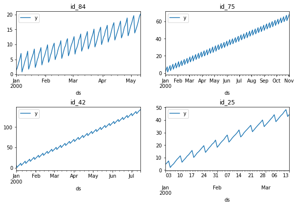

export const quartoRawHtml =
[`<div>
<style scoped>
    .dataframe tbody tr th:only-of-type {
        vertical-align: middle;
    }
    .dataframe tbody tr th {
        vertical-align: top;
    }
    .dataframe thead th {
        text-align: right;
    }
</style>
`,`
<p>27003 rows × 3 columns</p>
</div>`,`<div><strong>Dask DataFrame Structure:</strong></div>
<div>
<style scoped>
    .dataframe tbody tr th:only-of-type {
        vertical-align: middle;
    }
    .dataframe tbody tr th {
        vertical-align: top;
    }
    .dataframe thead th {
        text-align: right;
    }
</style>
`,`
</div>
<div>Dask Name: assign, 5 graph layers</div>`,`<div><strong>Dask DataFrame Structure:</strong></div>
<div>
<style scoped>
    .dataframe tbody tr th:only-of-type {
        vertical-align: middle;
    }
    .dataframe tbody tr th {
        vertical-align: top;
    }
    .dataframe thead th {
        text-align: right;
    }
</style>
`,`
</div>
<div>Dask Name: map, 17 graph layers</div>`];

> Minimal example of distributed training with MLForecast

## Main concepts {#main-concepts}

The main component for distributed training with mlforecast is the
`DistributedMLForecast` class, which abstracts away:

-   Feature engineering and model training through
    `DistributedMLForecast.fit`
-   Feature updates and multi step ahead predictions through
    `DistributedMLForecast.predict`

## Setup {#setup}

In order to perform distributed training you need a dask cluster. In
this example we’ll use a local cluster but you can replace it with any
other type of remote cluster and the processing will take place there.

<details>
<summary>Code</summary>

``` python
from dask.distributed import Client, LocalCluster

cluster = LocalCluster(n_workers=2, threads_per_worker=1)  # change this to use a remote cluster
client = Client(cluster)
```

</details>

## Data format {#data-format}

The data is expected to be a dask dataframe in long format, that is,
each row represents an observation of a single serie at a given time,
with at least three columns:

-   `id_col`: column that identifies each serie.
-   `target_col`: column that has the series values at each timestamp.
-   `time_col`: column that contains the time the series value was
    observed. These are usually timestamps, but can also be consecutive
    integers.

**You need to make sure that each serie is only in a single partition**.
You can do so by setting the id_col as the index in dask or with
repartitionByRange in spark.

Here we present an example with synthetic data.

<details>
<summary>Code</summary>

``` python
import dask.dataframe as dd
from mlforecast.utils import generate_daily_series
```

</details>
<details>
<summary>Code</summary>

``` python
series = generate_daily_series(100, with_trend=True)
series
```

</details>
<div dangerouslySetInnerHTML={{ __html: quartoRawHtml[0] }} />

|       | unique_id | ds         | y         |
|-------|-----------|------------|-----------|
| 0     | id_00     | 2000-01-01 | 0.497650  |
| 1     | id_00     | 2000-01-02 | 1.554489  |
| 2     | id_00     | 2000-01-03 | 2.734311  |
| 3     | id_00     | 2000-01-04 | 4.028039  |
| 4     | id_00     | 2000-01-05 | 5.366009  |
| ...   | ...       | ...        | ...       |
| 26998 | id_99     | 2000-06-25 | 34.165302 |
| 26999 | id_99     | 2000-06-26 | 28.277320 |
| 27000 | id_99     | 2000-06-27 | 29.450129 |
| 27001 | id_99     | 2000-06-28 | 30.241885 |
| 27002 | id_99     | 2000-06-29 | 31.576907 |

<div dangerouslySetInnerHTML={{ __html: quartoRawHtml[1] }} />

Here we can see that the index goes from `id_00` to `id_99`, which means
we have 100 different series stacked together.

We also have the `ds` column that contains the timestamps, in this case
with a daily frequency, and the `y` column that contains the series
values in each timestamp.

In order to perform distributed processing and training we need to have
these in a dask dataframe, this is typically done loading them directly
in a distributed way, for example with `dd.read_parquet`.

<details>
<summary>Code</summary>

``` python
series_ddf = dd.from_pandas(series.set_index('unique_id'), npartitions=2)  # make sure we split by id
series_ddf = series_ddf.map_partitions(lambda part: part.reset_index())  # we can't have an index
series_ddf['unique_id'] = series_ddf['unique_id'].astype('str') # categoricals aren't supported at the moment
series_ddf
```

</details>
<div dangerouslySetInnerHTML={{ __html: quartoRawHtml[2] }} />

|               | unique_id | ds               | y       |
|---------------|-----------|------------------|---------|
| npartitions=2 |           |                  |         |
| id_00         | object    | datetime64\[ns\] | float64 |
| id_49         | ...       | ...              | ...     |
| id_99         | ...       | ...              | ...     |

<div dangerouslySetInnerHTML={{ __html: quartoRawHtml[3] }} />

We now have a dask dataframe with two partitions which will be processed
independently in each machine and their outputs will be combined to
perform distributed training.

## Modeling {#modeling}

<details>
<summary>Code</summary>

``` python
import random
import matplotlib.pyplot as plt

def plot_sample(df, ax):
    idxs = df['unique_id'].unique()
    random.seed(0)
    sample_idxs = random.choices(idxs, k=4)
    for uid, axi in zip(sample_idxs, ax.flat):
        df[df['unique_id'].eq(uid)].set_index('ds').plot(ax=axi, title=uid)
```

</details>
<details>
<summary>Code</summary>

``` python
fig, ax = plt.subplots(nrows=2, ncols=2, figsize=(10, 6), gridspec_kw=dict(hspace=0.5))
plot_sample(series, ax)
fig.savefig('../figs/quick_start_distributed__sample.png', bbox_inches='tight')
plt.close()
```

</details>



We can see that the series have a clear trend, so we can take the first
difference, i.e. take each value and subtract the value at the previous
month. This can be achieved by passing an
`mlforecast.target_transforms.Differences([1])` instance to
`target_transforms`.

We can then train a LightGBM model using the value from the same day of
the week at the previous week (lag 7) as a feature, this is done by
passing `lags=[7]`.

<details>
<summary>Code</summary>

``` python
from mlforecast.distributed import DistributedMLForecast
from mlforecast.distributed.models.dask.lgb import DaskLGBMForecast
from mlforecast.target_transforms import Differences
```

</details>
<details>
<summary>Code</summary>

``` python
fcst = DistributedMLForecast(
    models=DaskLGBMForecast(verbosity=-1),
    freq='D',
    lags=[7],
    target_transforms=[Differences([1])],
)
fcst.fit(series_ddf)
```

</details>

``` text
/home/jose/mambaforge/envs/mlforecast/lib/python3.10/site-packages/lightgbm/dask.py:525: UserWarning: Parameter n_jobs will be ignored.
  _log_warning(f"Parameter {param_alias} will be ignored.")
```

``` text
Finding random open ports for workers
[LightGBM] [Info] Trying to bind port 52367...
[LightGBM] [Info] Binding port 52367 succeeded
[LightGBM] [Info] Listening...
[LightGBM] [Info] Trying to bind port 48789...
[LightGBM] [Info] Binding port 48789 succeeded
[LightGBM] [Info] Listening...
[LightGBM] [Info] Connected to rank 1
[LightGBM] [Info] Connected to rank 0
[LightGBM] [Info] Local rank: 0, total number of machines: 2
[LightGBM] [Info] Local rank: 1, total number of machines: 2
[LightGBM] [Warning] num_threads is set=1, n_jobs=-1 will be ignored. Current value: num_threads=1
[LightGBM] [Warning] num_threads is set=1, n_jobs=-1 will be ignored. Current value: num_threads=1
```

``` text
DistributedMLForecast(models=[DaskLGBMForecast], freq=<Day>, lag_features=['lag7'], date_features=[], num_threads=1, engine=None)
```

The previous line computed the features and trained the model, so now
we’re ready to compute our forecasts.

## Forecasting {#forecasting}

Compute the forecast for the next 14 days.

<details>
<summary>Code</summary>

``` python
preds = fcst.predict(14)
preds
```

</details>
<div dangerouslySetInnerHTML={{ __html: quartoRawHtml[4] }} />

|               | unique_id | ds               | DaskLGBMForecast |
|---------------|-----------|------------------|------------------|
| npartitions=2 |           |                  |                  |
| id_00         | object    | datetime64\[ns\] | float64          |
| id_49         | ...       | ...              | ...              |
| id_99         | ...       | ...              | ...              |

<div dangerouslySetInnerHTML={{ __html: quartoRawHtml[5] }} />

These are returned as a dask dataframe as well. If it’s safe
(memory-wise) we can bring them to the main process.

<details>
<summary>Code</summary>

``` python
local_preds = preds.compute()
```

</details>

## Visualize results {#visualize-results}

We can visualize what our prediction looks like.

<details>
<summary>Code</summary>

``` python
import pandas as pd
```

</details>
<details>
<summary>Code</summary>

``` python
fig, ax = plt.subplots(nrows=2, ncols=2, figsize=(10, 6), gridspec_kw=dict(hspace=0.5))
plot_sample(pd.concat([series, local_preds.set_index('unique_id')]), ax)
fig.savefig('../figs/quick_start_distributed__sample_prediction.png', bbox_inches='tight')
plt.close()
```

</details>


And that’s it! You’ve trained a distributed LightGBM model and computed
predictions for the next 14 days.

