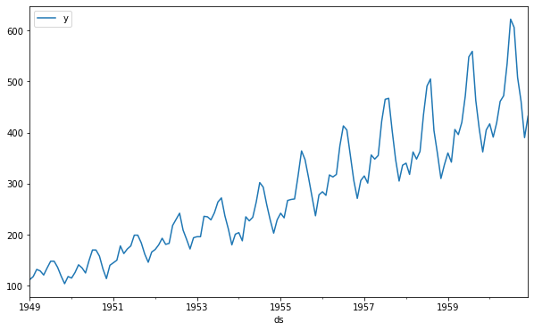
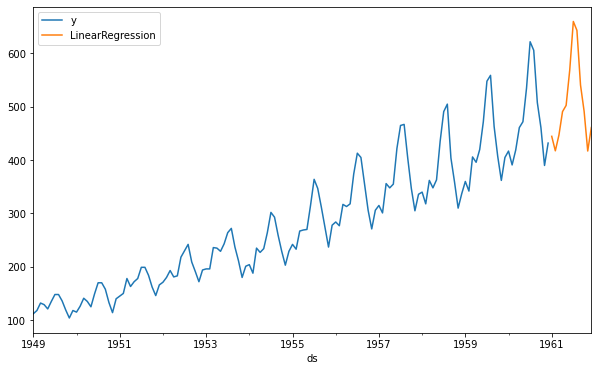

export const quartoRawHtml =
[`<div>
<style scoped>
    .dataframe tbody tr th:only-of-type {
        vertical-align: middle;
    }
    .dataframe tbody tr th {
        vertical-align: top;
    }
    .dataframe thead th {
        text-align: right;
    }
</style>
`,`
</div>`,`<div>
<style scoped>
    .dataframe tbody tr th:only-of-type {
        vertical-align: middle;
    }
    .dataframe tbody tr th {
        vertical-align: top;
    }
    .dataframe thead th {
        text-align: right;
    }
</style>
`,`
</div>`];

> Minimal example of MLForecast

## Main concepts {#main-concepts}

The main component of mlforecast is the `MLForecast` class, which
abstracts away:

-   Feature engineering and model training through `MLForecast.fit`
-   Feature updates and multi step ahead predictions through
    `MLForecast.predict`

## Data format {#data-format}

The data is expected to be a pandas dataframe in long format, that is,
each row represents an observation of a single serie at a given time,
with at least three columns:

-   `id_col`: column that identifies each serie.
-   `target_col`: column that has the series values at each timestamp.
-   `time_col`: column that contains the time the series value was
    observed. These are usually timestamps, but can also be consecutive
    integers.

Here we present an example using the classic Box & Jenkins airline data,
which measures monthly totals of international airline passengers from
1949 to 1960. Source: Box, G. E. P., Jenkins, G. M. and Reinsel, G. C.
(1976) Time Series Analysis, Forecasting and Control. Third Edition.
Holden-Day. Series G.

<details>
<summary>Code</summary>

``` python
import pandas as pd
```

</details>
<details>
<summary>Code</summary>

``` python
df = pd.read_csv('https://datasets-nixtla.s3.amazonaws.com/air-passengers.csv', parse_dates=['ds'])
df.head()
```

</details>
<div dangerouslySetInnerHTML={{ __html: quartoRawHtml[0] }} />

|     | unique_id     | ds         | y   |
|-----|---------------|------------|-----|
| 0   | AirPassengers | 1949-01-01 | 112 |
| 1   | AirPassengers | 1949-02-01 | 118 |
| 2   | AirPassengers | 1949-03-01 | 132 |
| 3   | AirPassengers | 1949-04-01 | 129 |
| 4   | AirPassengers | 1949-05-01 | 121 |

<div dangerouslySetInnerHTML={{ __html: quartoRawHtml[1] }} />

<details>
<summary>Code</summary>

``` python
df['unique_id'].value_counts()
```

</details>

``` text
AirPassengers    144
Name: unique_id, dtype: int64
```

Here the `unique_id` column has the same value for all rows because this
is a single time series, you can have multiple time series by stacking
them together and having a column that differentiates them.

We also have the `ds` column that contains the timestamps, in this case
with a monthly frequency, and the `y` column that contains the series
values in each timestamp.

## Modeling {#modeling}

<details>
<summary>Code</summary>

``` python
df.plot(x='ds', y='y', figsize=(10, 6));
```

</details>



We can see that the serie has a clear trend, so we can take the first
difference, i.e. take each value and subtract the value at the previous
month. This can be achieved by passing an
`mlforecast.target_transforms.Differences([1])` instance to
`target_transforms`.

We can then train a linear regression using the value from the same
month at the previous year (lag 12) as a feature, this is done by
passing `lags=[12]`.

<details>
<summary>Code</summary>

``` python
from mlforecast import MLForecast
from mlforecast.target_transforms import Differences
from sklearn.linear_model import LinearRegression
```

</details>
<details>
<summary>Code</summary>

``` python
fcst = MLForecast(
    models=LinearRegression(),
    freq='MS',  # our serie has a monthly frequency
    lags=[12],
    target_transforms=[Differences([1])],
)
fcst.fit(df)
```

</details>

``` text
MLForecast(models=[LinearRegression], freq=<MonthBegin>, lag_features=['lag12'], date_features=[], num_threads=1)
```

The previous line computed the features and trained the model, so now
we’re ready to compute our forecasts.

## Forecasting {#forecasting}

Compute the forecast for the next 12 months

<details>
<summary>Code</summary>

``` python
preds = fcst.predict(12)
preds
```

</details>
<div dangerouslySetInnerHTML={{ __html: quartoRawHtml[2] }} />

|     | unique_id     | ds         | LinearRegression |
|-----|---------------|------------|------------------|
| 0   | AirPassengers | 1961-01-01 | 444.656555       |
| 1   | AirPassengers | 1961-02-01 | 417.470734       |
| 2   | AirPassengers | 1961-03-01 | 446.903046       |
| 3   | AirPassengers | 1961-04-01 | 491.014130       |
| 4   | AirPassengers | 1961-05-01 | 502.622223       |
| 5   | AirPassengers | 1961-06-01 | 568.751465       |
| 6   | AirPassengers | 1961-07-01 | 660.044312       |
| 7   | AirPassengers | 1961-08-01 | 643.343323       |
| 8   | AirPassengers | 1961-09-01 | 540.666687       |
| 9   | AirPassengers | 1961-10-01 | 491.462708       |
| 10  | AirPassengers | 1961-11-01 | 417.095154       |
| 11  | AirPassengers | 1961-12-01 | 461.206238       |

<div dangerouslySetInnerHTML={{ __html: quartoRawHtml[3] }} />

## Visualize results {#visualize-results}

We can visualize what our prediction looks like.

<details>
<summary>Code</summary>

``` python
pd.concat([df, preds]).set_index('ds').plot(figsize=(10, 6));
```

</details>



And that’s it! You’ve trained a linear regression to predict the air
passengers for 1961.

