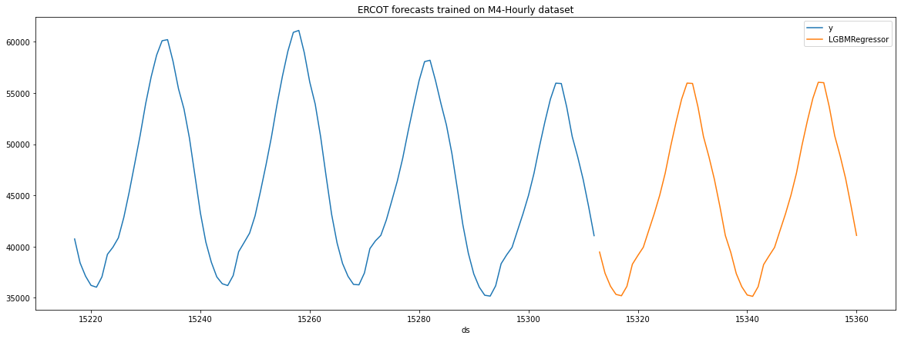
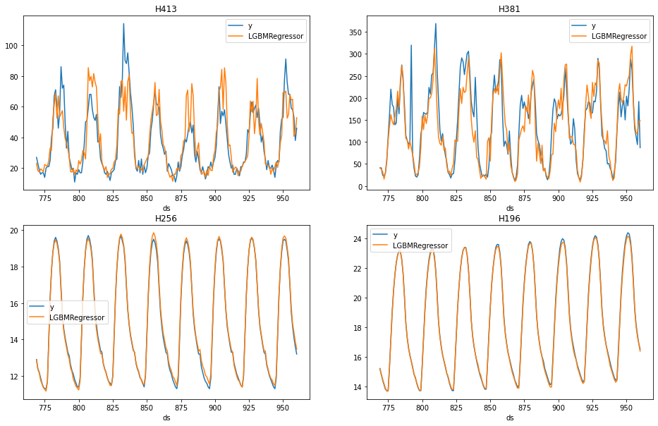

export const quartoRawHtml =
[`<div>
<style scoped>
    .dataframe tbody tr th:only-of-type {
        vertical-align: middle;
    }
    .dataframe tbody tr th {
        vertical-align: top;
    }
    .dataframe thead th {
        text-align: right;
    }
</style>
`,`
<p>4032 rows × 3 columns</p>
</div>`,`<div>
<style scoped>
    .dataframe tbody tr th:only-of-type {
        vertical-align: middle;
    }
    .dataframe tbody tr th {
        vertical-align: top;
    }
    .dataframe thead th {
        text-align: right;
    }
</style>
`,`
</div>`,`<div>
<style scoped>
    .dataframe tbody tr th:only-of-type {
        vertical-align: middle;
    }
    .dataframe tbody tr th {
        vertical-align: top;
    }
    .dataframe thead th {
        text-align: right;
    }
</style>
`,`
<p>3072 rows × 11 columns</p>
</div>`,`<div>
<style scoped>
    .dataframe tbody tr th:only-of-type {
        vertical-align: middle;
    }
    .dataframe tbody tr th {
        vertical-align: top;
    }
    .dataframe thead th {
        text-align: right;
    }
</style>
`,`
</div>`,`<div>
<style scoped>
    .dataframe tbody tr th:only-of-type {
        vertical-align: middle;
    }
    .dataframe tbody tr th {
        vertical-align: top;
    }
    .dataframe thead th {
        text-align: right;
    }
</style>
`,`
<p>768 rows × 5 columns</p>
</div>`,`<div>
<style scoped>
    .dataframe tbody tr th:only-of-type {
        vertical-align: middle;
    }
    .dataframe tbody tr th {
        vertical-align: top;
    }
    .dataframe thead th {
        text-align: right;
    }
</style>
`,`
<p>13440 rows × 5 columns</p>
</div>`,`<div>
<style scoped>
    .dataframe tbody tr th:only-of-type {
        vertical-align: middle;
    }
    .dataframe tbody tr th {
        vertical-align: top;
    }
    .dataframe thead th {
        text-align: right;
    }
</style>
`,`
<p>768 rows × 9 columns</p>
</div>`,`<div>
<style scoped>
    .dataframe tbody tr th:only-of-type {
        vertical-align: middle;
    }
    .dataframe tbody tr th {
        vertical-align: top;
    }
    .dataframe thead th {
        text-align: right;
    }
</style>
`,`
<p>192 rows × 3 columns</p>
</div>`,`<div>
<style scoped>
    .dataframe tbody tr th:only-of-type {
        vertical-align: middle;
    }
    .dataframe tbody tr th {
        vertical-align: top;
    }
    .dataframe thead th {
        text-align: right;
    }
</style>
`,`
<p>27003 rows × 5 columns</p>
</div>`,`<div>
<style scoped>
    .dataframe tbody tr th:only-of-type {
        vertical-align: middle;
    }
    .dataframe tbody tr th {
        vertical-align: top;
    }
    .dataframe thead th {
        text-align: right;
    }
</style>
`,`
<p>20185 rows × 3 columns</p>
</div>`,`<div>
<style scoped>
    .dataframe tbody tr th:only-of-type {
        vertical-align: middle;
    }
    .dataframe tbody tr th {
        vertical-align: top;
    }
    .dataframe thead th {
        text-align: right;
    }
</style>
`,`
<p>27003 rows × 6 columns</p>
</div>`,`<div>
<style scoped>
    .dataframe tbody tr th:only-of-type {
        vertical-align: middle;
    }
    .dataframe tbody tr th {
        vertical-align: top;
    }
    .dataframe thead th {
        text-align: right;
    }
</style>
`,`
<p>700 rows × 3 columns</p>
</div>`,`<div>
<style scoped>
    .dataframe tbody tr th:only-of-type {
        vertical-align: middle;
    }
    .dataframe tbody tr th {
        vertical-align: top;
    }
    .dataframe thead th {
        text-align: right;
    }
</style>
`,`
</div>`,`<div>
<style scoped>
    .dataframe tbody tr th:only-of-type {
        vertical-align: middle;
    }
    .dataframe tbody tr th {
        vertical-align: top;
    }
    .dataframe thead th {
        text-align: right;
    }
</style>
`,`
</div>`,`<div>
<style scoped>
    .dataframe tbody tr th:only-of-type {
        vertical-align: middle;
    }
    .dataframe tbody tr th {
        vertical-align: top;
    }
    .dataframe thead th {
        text-align: right;
    }
</style>
`,`
<p>200 rows × 3 columns</p>
</div>`];

::: {.cell 0=‘h’ 1=‘i’ 2=‘d’ 3=‘e’}

<details>
<summary>Code</summary>

``` python
%load_ext autoreload
%autoreload 2
```

</details>

:::

> Full pipeline encapsulation

::: {.cell 0=‘e’ 1=‘x’ 2=‘p’ 3=‘o’ 4=‘r’ 5=‘t’}

<details>
<summary>Code</summary>

``` python
import copy
import warnings
from typing import TYPE_CHECKING, Callable, Dict, Iterable, List, Optional, Tuple, Union

import numpy as np
import pandas as pd
from sklearn.base import BaseEstimator, clone

from mlforecast.core import (
    DateFeature,
    Freq,
    LagTransforms,
    Lags,
    Models,
    TimeSeries,
    _name_models,
)
if TYPE_CHECKING:
    from mlforecast.lgb_cv import LightGBMCV
from mlforecast.target_transforms import BaseTargetTransform
from mlforecast.utils import backtest_splits, PredictionIntervals
```

</details>

:::

::: {.cell 0=‘h’ 1=‘i’ 2=‘d’ 3=‘e’}

<details>
<summary>Code</summary>

``` python
from fastcore.test import test_warns, test_eq, test_ne, test_fail, test_close
from nbdev import show_doc
from sklearn import set_config
```

</details>

:::

::: {.cell 0=‘h’ 1=‘i’ 2=‘d’ 3=‘e’}

<details>
<summary>Code</summary>

``` python
set_config(display='text')
warnings.simplefilter('ignore', UserWarning)
```

</details>

:::

::: {.cell 0=‘e’ 1=‘x’ 2=‘p’ 3=‘o’ 4=‘r’ 5=‘t’ 6=‘i’}

<details>
<summary>Code</summary>

``` python
def _add_conformal_distribution_intervals(
        fcst_df: pd.DataFrame, 
        cs_df: pd.DataFrame, 
        model_names: List[str],
        level: List[Union[int, float]],
        cs_n_windows: int,
        cs_window_size: int,
        n_series: int,
        horizon: int,
    ) -> pd.DataFrame:
    """
    Adds conformal intervals to a `fcst_df` based on conformal scores `cs_df`.
    `level` should be already sorted. This strategy creates forecasts paths
    based on errors and calculate quantiles using those paths.
    """
    fcst_df = fcst_df.copy()
    alphas = [100 - lv for lv in level]
    cuts = [alpha / 200 for alpha in reversed(alphas)]
    cuts.extend(1 - alpha / 200 for alpha in alphas)
    for model in model_names:
        scores = cs_df[model].values.reshape(cs_n_windows, n_series, cs_window_size)
        # restrict scores to horizon
        scores = scores[:,:,:horizon]
        mean = fcst_df[model].values.reshape(1, n_series, -1)
        scores = np.vstack([mean - scores, mean + scores])
        quantiles = np.quantile(
            scores,
            cuts,
            axis=0,
        )
        quantiles = quantiles.reshape(len(cuts), -1)
        lo_cols = [f"{model}-lo-{lv}" for lv in reversed(level)]
        hi_cols = [f"{model}-hi-{lv}" for lv in level]
        out_cols = lo_cols + hi_cols
        for i, col in enumerate(out_cols):
            fcst_df[col] = quantiles[i]
    return fcst_df
```

</details>

:::

::: {.cell 0=‘e’ 1=‘x’ 2=‘p’ 3=‘o’ 4=‘r’ 5=‘t’ 6=‘i’}

<details>
<summary>Code</summary>

``` python
def _add_conformal_error_intervals(
        fcst_df: pd.DataFrame, 
        cs_df: pd.DataFrame, 
        model_names: List[str],
        level: List[Union[int, float]],
        cs_n_windows: int,
        cs_window_size: int,
        n_series: int,
        horizon: int,
    ) -> pd.DataFrame:
    """
    Adds conformal intervals to a `fcst_df` based on conformal scores `cs_df`.
    `level` should be already sorted. This startegy creates prediction intervals
    based on the absolute errors.
    """
    fcst_df = fcst_df.copy()
    cuts = [lv / 100 for lv in level]
    for model in model_names:
        mean = fcst_df[model].values.ravel()
        scores = cs_df[model].values.reshape(cs_n_windows, n_series, cs_window_size)
        # restrict scores to horizon
        scores = scores[:,:,:horizon]
        quantiles = np.quantile(
            scores,
            cuts,
            axis=0,
        )
        quantiles = quantiles.reshape(len(cuts), -1)
        lo_cols = [f"{model}-lo-{lv}" for lv in reversed(level)]
        hi_cols = [f"{model}-hi-{lv}" for lv in level]
        for i, col in enumerate(lo_cols):
            fcst_df[col] = mean - quantiles[len(level) - 1 - i]
        for i, col in enumerate(hi_cols):
            fcst_df[col] = mean + quantiles[i]
    return fcst_df
```

</details>

:::

::: {.cell 0=‘e’ 1=‘x’ 2=‘p’ 3=‘o’ 4=‘r’ 5=‘t’ 6=‘i’}

<details>
<summary>Code</summary>

``` python
def _get_conformal_method(method: str):
    available_methods = {
        'conformal_distribution': _add_conformal_distribution_intervals,
        'conformal_error': _add_conformal_error_intervals, 
    }
    if method not in available_methods.keys():
        raise ValueError(
            f'prediction intervals method {method} not supported '
            f'please choose one of {", ".join(available_methods.keys())}'
        )
    return available_methods[method]
```

</details>

:::

::: {.cell 0=‘h’ 1=‘i’ 2=‘d’ 3=‘e’}

<details>
<summary>Code</summary>

``` python
test_fail(lambda: _get_conformal_method('my_method'))
```

</details>

:::

::: {.cell 0=‘e’ 1=‘x’ 2=‘p’ 3=‘o’ 4=‘r’ 5=‘t’}

<details>
<summary>Code</summary>

``` python
class MLForecast:
    def __init__(
        self,
        models: Models,
        freq: Optional[Freq] = None,
        lags: Optional[Lags] = None,
        lag_transforms: Optional[LagTransforms] = None,
        date_features: Optional[Iterable[DateFeature]] = None,
        differences: Optional[Iterable[int]] = None,
        num_threads: int = 1,
        target_transforms: Optional[List[BaseTargetTransform]] = None,
    ):
        """Create forecast object

        Parameters
        ----------
        models : regressor or list of regressors
            Models that will be trained and used to compute the forecasts.
        freq : str or int or pd.offsets.BaseOffset, optional (default=None)
            Pandas offset, pandas offset alias, e.g. 'D', 'W-THU' or integer denoting the frequency of the series.
        lags : list of int, optional (default=None)
            Lags of the target to use as features.
        lag_transforms : dict of int to list of functions, optional (default=None)
            Mapping of target lags to their transformations.
        date_features : list of str or callable, optional (default=None)
            Features computed from the dates. Can be pandas date attributes or functions that will take the dates as input.
        differences : list of int, optional (default=None)
            Differences to take of the target before computing the features. These are restored at the forecasting step.
        num_threads : int (default=1)
            Number of threads to use when computing the features.
        target_transforms : list of transformers, optional(default=None)
            Transformations that will be applied to the target before computing the features and restored after the forecasting step.
        """
        if not isinstance(models, dict) and not isinstance(models, list):
            models = [models]
        if isinstance(models, list):
            model_names = _name_models([m.__class__.__name__ for m in models])            
            models_with_names = dict(zip(model_names, models))
        else:
            models_with_names = models
        self.models = models_with_names
        self.ts = TimeSeries(
            freq=freq,
            lags=lags,
            lag_transforms=lag_transforms,
            date_features=date_features,
            differences=differences,
            num_threads=num_threads,
            target_transforms=target_transforms
        )
        
    def __repr__(self):
        return (
            f'{self.__class__.__name__}(models=[{", ".join(self.models.keys())}], '
            f'freq={self.freq}, '
            f'lag_features={list(self.ts.transforms.keys())}, '
            f'date_features={self.ts.date_features}, '
            f'num_threads={self.ts.num_threads})'
        )
    
    @property
    def freq(self):
        return self.ts.freq
    
    @classmethod
    def from_cv(cls, cv: 'LightGBMCV') -> 'MLForecast':
        if not hasattr(cv, 'best_iteration_'):
            raise ValueError('LightGBMCV object must be fitted first.')
        import lightgbm as lgb
        fcst = cls(lgb.LGBMRegressor(**{**cv.params, 'n_estimators': cv.best_iteration_}))
        fcst.ts = copy.deepcopy(cv.ts)
        return fcst

    def preprocess(
        self,
        data: pd.DataFrame,
        id_col: str = 'unique_id',
        time_col: str = 'ds',
        target_col: str = 'y',
        static_features: Optional[List[str]] = None,
        dropna: bool = True,
        keep_last_n: Optional[int] = None,
        max_horizon: Optional[int] = None,
        return_X_y: bool = False,
    ) -> Union[pd.DataFrame, Tuple[pd.DataFrame, Union[pd.Series, pd.DataFrame]]]:
        """Add the features to `data`.
        
        Parameters
        ----------
        data : pandas DataFrame
            Series data in long format.
        id_col : str (default='unique_id')
            Column that identifies each serie.
        time_col : str (default='ds')
            Column that identifies each timestep, its values can be timestamps or integers.
        target_col : str (default='y')
            Column that contains the target.
        static_features : list of str, optional (default=None)
            Names of the features that are static and will be repeated when forecasting.
        dropna : bool (default=True)
            Drop rows with missing values produced by the transformations.
        keep_last_n : int, optional (default=None)
            Keep only these many records from each serie for the forecasting step. Can save time and memory if your features allow it.
        max_horizon: int, optional (default=None)
            Train this many models, where each model will predict a specific horizon.
        return_X_y: bool (default=False)
            Return a tuple with the features and the target. If False will return a single dataframe.

        Returns
        -------
        result : pandas DataFrame or tuple of pandas Dataframe and either a pandas Series or a pandas Dataframe (for multi-output regression).
            `data` plus added features and target(s).
        """
        return self.ts.fit_transform(
            data,
            id_col=id_col,
            time_col=time_col,
            target_col=target_col,
            static_features=static_features,
            dropna=dropna,
            keep_last_n=keep_last_n,
            max_horizon=max_horizon,
            return_X_y=return_X_y,
        )
    
    def fit_models(
        self,
        X: pd.DataFrame,
        y: Union[pd.Series, pd.DataFrame],
    ) -> 'MLForecast':
        """Manually train models. Use this if you called `Forecast.preprocess` beforehand.
        
        Parameters
        ----------
        X : pandas DataFrame
            Features.
        y : pandas Series or pandas DataFrame (multi-output).
            Target.
            
        Returns
        -------
        self : MLForecast
            Forecast object with trained models.
        """
        self.models_: Dict[str, Union[BaseEstimator, List[BaseEstimator]]] = {}
        for name, model in self.models.items():
            if y.ndim == 2 and y.shape[1] > 1:
                self.models_[name] = []                
                for col in y:
                    keep = y[col].notnull()
                    self.models_[name].append(clone(model).fit(X.loc[keep], y.loc[keep, col]))
            else:
                self.models_[name] = clone(model).fit(X, y)
        return self
    
    def _conformity_scores(
        self,
        data: pd.DataFrame, 
        id_col: str, 
        time_col: str,
        target_col: str,
        static_features: Optional[List[str]] = None,
        dropna: bool = True,
        keep_last_n: Optional[int] = None,
        max_horizon: Optional[int] = None,
        n_windows: int = 2,
        window_size: int = 1,
    ):
        """Compute conformity scores.
        
        We need at least two cross validation errors to compute
        quantiles for prediction intervals (`n_windows=2`).
        
        The exception is raised by the PredictionIntervals data class.
        
        In this simplest case, we assume the width of the interval
        is the same for all the forecasting horizon (`window_size=1`).
        """
        cv_results = self.cross_validation(
            data=data, 
            n_windows=n_windows,
            window_size=window_size,
            refit=False,
            id_col=id_col, 
            time_col=time_col,
            target_col=target_col,
            static_features=static_features,
            dropna=dropna,
            keep_last_n=keep_last_n,
            max_horizon=max_horizon,
            prediction_intervals=None,
        )
        # conformity score for each model
        for model in self.models.keys():
            # compute absolute error for each model
            cv_results[model] = np.abs(cv_results[model] - cv_results[target_col])
        return cv_results.drop(columns=target_col)

    def fit(
        self,
        data: pd.DataFrame,
        id_col: str = 'unique_id',
        time_col: str = 'ds',
        target_col: str = 'y',
        static_features: Optional[List[str]] = None,
        dropna: bool = True,
        keep_last_n: Optional[int] = None,
        max_horizon: Optional[int] = None,
        prediction_intervals: Optional[PredictionIntervals] = None,
    ) -> 'MLForecast':
        """Apply the feature engineering and train the models.
        
        Parameters
        ----------
        data : pandas DataFrame
            Series data in long format.
        id_col : str (default='unique_id')
            Column that identifies each serie.
        time_col : str (default='ds')
            Column that identifies each timestep, its values can be timestamps or integers.
        target_col : str (default='y')
            Column that contains the target.
        static_features : list of str, optional (default=None)
            Names of the features that are static and will be repeated when forecasting.
        dropna : bool (default=True)
            Drop rows with missing values produced by the transformations.
        keep_last_n : int, optional (default=None)
            Keep only these many records from each serie for the forecasting step. Can save time and memory if your features allow it.
        max_horizon: int, optional (default=None)
            Train this many models, where each model will predict a specific horizon.
        prediction_intervals : PredictionIntervals, optional (default=None)
            Configuration to calibrate prediction intervals (Conformal Prediction).

        Returns
        -------
        self : MLForecast
            Forecast object with series values and trained models.
        """
        self._cs_df: Optional[pd.DataFrame] = None
        if prediction_intervals is not None:
            self.prediction_intervals = prediction_intervals
            self._cs_df = self._conformity_scores(
                data=data, 
                id_col=id_col, 
                time_col=time_col,
                target_col=target_col,
                static_features=static_features,
                dropna=dropna,
                keep_last_n=keep_last_n,
                n_windows=prediction_intervals.n_windows,
                window_size=prediction_intervals.window_size,
            )
        X, y = self.preprocess(
            data,
            id_col=id_col,
            time_col=time_col,
            target_col=target_col,
            static_features=static_features,
            dropna=dropna,
            keep_last_n=keep_last_n,
            max_horizon=max_horizon,
            return_X_y=True,
        )
        X = X[self.ts.features_order_]
        return self.fit_models(X, y)

    def predict(
        self,
        horizon: int,
        dynamic_dfs: Optional[List[pd.DataFrame]] = None,
        before_predict_callback: Optional[Callable] = None,
        after_predict_callback: Optional[Callable] = None,
        new_data: Optional[pd.DataFrame] = None,
        level: Optional[List[Union[int, float]]] = None,
    ) -> pd.DataFrame:
        """Compute the predictions for the next `horizon` steps.
        
        Parameters
        ----------
        horizon : int
            Number of periods to predict.
        dynamic_dfs : list of pandas DataFrame, optional (default=None)
            Future values of the dynamic features, e.g. prices.
        before_predict_callback : callable, optional (default=None)
            Function to call on the features before computing the predictions.
                This function will take the input dataframe that will be passed to the model for predicting and should return a dataframe with the same structure.
                The series identifier is on the index.
        after_predict_callback : callable, optional (default=None)
            Function to call on the predictions before updating the targets.
                This function will take a pandas Series with the predictions and should return another one with the same structure.
                The series identifier is on the index.   
        new_data : pandas DataFrame, optional (default=None)
            Series data of new observations for which forecasts are to be generated. 
                This dataframe should have the same structure as the one used to fit the model, including any features and time series data. 
                If `new_data` is not None, the method will generate forecasts for the new observations.
        level : list of ints or floats, optional (default=None)
            Confidence levels between 0 and 100 for prediction intervals.

        Returns
        -------
        result : pandas DataFrame
            Predictions for each serie and timestep, with one column per model.
        """
        if not hasattr(self, 'models_'):
            raise ValueError('No fitted models found. You have to call fit or preprocess + fit_models.')
            
        if new_data is not None:
            new_ts = TimeSeries(
                freq=self.ts.freq,
                lags=self.ts.lags, 
                lag_transforms=self.ts.lag_transforms,
                date_features=self.ts.date_features, 
                num_threads=self.ts.num_threads,
                target_transforms=self.ts.target_transforms,
            )
            new_ts._fit(
                new_data,
                id_col=self.ts.id_col,
                time_col=self.ts.time_col,
                target_col=self.ts.target_col, 
                static_features=self.ts.static_features,
                keep_last_n=self.ts.keep_last_n,
            )
            new_ts.max_horizon = self.ts.max_horizon
            ts = new_ts
        else:
            ts = self.ts
            
        forecasts = ts.predict(
            self.models_, horizon, dynamic_dfs, before_predict_callback, after_predict_callback
        )
        if level is not None:
            if self._cs_df is None:
                warn_msg = (
                    'Please rerun the `fit` method passing a proper value '
                    'to prediction intervals to compute them.'
                )
                warnings.warn(warn_msg, UserWarning)
            else:
                if (self.prediction_intervals.window_size != 1) and (self.prediction_intervals.window_size < horizon):
                    raise ValueError(
                        'The `window_size` argument of PredictionIntervals '
                        'should be equal to one or greater or equal to `horizon`. '
                        'Please rerun the `fit` method passing a proper value '
                        'to prediction intervals.'
                    )
                if self.prediction_intervals.window_size == 1 and horizon > 1:
                    warn_msg = (
                        'Prediction intervals are calculated using 1-step ahead cross-validation, '
                        'with a constant width for all horizons. To vary the error by horizon, '
                        'pass PredictionIntervals(window_size=horizon) to the `prediction_intervals` '
                        'argument when refitting the model.'
                    )
                    warnings.warn(warn_msg, UserWarning)
                level_ = sorted(level)
                model_names = self.models.keys()
                conformal_method = _get_conformal_method(self.prediction_intervals.method)
                forecasts = conformal_method(
                    forecasts,
                    self._cs_df,
                    model_names=list(model_names),
                    level=level_,
                    cs_window_size=self.prediction_intervals.window_size,
                    cs_n_windows=self.prediction_intervals.n_windows,
                    n_series=self.ts.ga.ngroups,
                    horizon=horizon,
                )
        return forecasts

    def cross_validation(
        self,
        data: pd.DataFrame,
        n_windows: int,
        window_size: int,
        id_col: str = 'unique_id',
        time_col: str = 'ds',
        target_col: str = 'y',
        step_size: Optional[int] = None,
        static_features: Optional[List[str]] = None,
        dropna: bool = True,
        keep_last_n: Optional[int] = None,
        refit: bool = True,
        max_horizon: Optional[int] = None,
        before_predict_callback: Optional[Callable] = None,
        after_predict_callback: Optional[Callable] = None,
        prediction_intervals: Optional[PredictionIntervals] = None,
        level: Optional[List[Union[int, float]]] = None,
        input_size: Optional[int] = None,
        fitted: bool = False,
    ):
        """Perform time series cross validation.
        Creates `n_windows` splits where each window has `window_size` test periods, 
        trains the models, computes the predictions and merges the actuals.
        
        Parameters
        ----------
        data : pandas DataFrame
            Series data in long format.
        n_windows : int
            Number of windows to evaluate.
        window_size : int
            Number of test periods in each window.
        id_col : str (default='unique_id')
            Column that identifies each serie.
        time_col : str (default='ds')
            Column that identifies each timestep, its values can be timestamps or integers.
        target_col : str (default='y')
            Column that contains the target.
        step_size : int, optional (default=None)
            Step size between each cross validation window. If None it will be equal to `window_size`.
        static_features : list of str, optional (default=None)
            Names of the features that are static and will be repeated when forecasting.
        dropna : bool (default=True)
            Drop rows with missing values produced by the transformations.
        keep_last_n : int, optional (default=None)
            Keep only these many records from each serie for the forecasting step. Can save time and memory if your features allow it.
        max_horizon: int, optional (default=None)
            Train this many models, where each model will predict a specific horizon.            
        refit : bool (default=True)
            Retrain model for each cross validation window.
            If False, the models are trained at the beginning and then used to predict each window.
        before_predict_callback : callable, optional (default=None)
            Function to call on the features before computing the predictions.
                This function will take the input dataframe that will be passed to the model for predicting and should return a dataframe with the same structure.
                The series identifier is on the index.
        after_predict_callback : callable, optional (default=None)
            Function to call on the predictions before updating the targets.
                This function will take a pandas Series with the predictions and should return another one with the same structure.
                The series identifier is on the index.
        prediction_intervals : PredictionIntervals, optional (default=None)
            Configuration to calibrate prediction intervals (Conformal Prediction).
        level : list of ints or floats, optional (default=None)
            Confidence levels between 0 and 100 for prediction intervals.
        input_size : int, optional (default=None)
            Maximum training samples per serie in each window. If None, will use an expanding window.
        fitted : bool (default=False)
            Store the in-sample predictions.

        Returns
        -------
        result : pandas DataFrame
            Predictions for each window with the series id, timestamp, last train date, target value and predictions from each model.
        """
        if hasattr(self, 'models_'):
            warnings.warn('Excuting `cross_validation` after `fit` can produce unexpected errors')
        results = []
        self.cv_models_ = []
        if np.issubdtype(data[time_col].dtype.type, np.integer):
            freq = 1
        else:
            freq = self.freq
            
        splits = backtest_splits(
            data,
            n_windows=n_windows,
            window_size=window_size,
            id_col=id_col,
            time_col=time_col,
            freq=freq,
            step_size=step_size,
            input_size=input_size,
        )
        ex_cols_to_drop = [id_col, time_col, target_col]
        if static_features is not None:
            ex_cols_to_drop.extend(static_features)
        has_ex = not data.columns.drop(ex_cols_to_drop).empty
        self.cv_fitted_values_ = []
        for i_window, (cutoffs, train, valid) in enumerate(splits):
            if refit or i_window == 0:
                self.fit(
                    train,
                    id_col=id_col,
                    time_col=time_col,
                    target_col=target_col,
                    static_features=static_features,
                    dropna=dropna,
                    keep_last_n=keep_last_n,
                    max_horizon=max_horizon,
                    prediction_intervals=prediction_intervals,
                )
            self.cv_models_.append(self.models_)
            if fitted:
                insample_results = train[[id_col, time_col]].copy()
                trainX, _ = self.preprocess(
                    train,
                    id_col=id_col,
                    time_col=time_col,
                    target_col=target_col,
                    static_features=static_features,
                    dropna=False,
                    keep_last_n=keep_last_n,
                    max_horizon=max_horizon,
                    return_X_y=True,
                )
                trainX = trainX[self.ts.features_order_]
                for name, model in self.models_.items():
                    insample_results[name] = model.predict(trainX)  # type: ignore[union-attr]
                if self.ts.target_transforms is not None:
                    for tfm in self.ts.target_transforms[::-1]:
                        insample_results = tfm.inverse_transform(insample_results)
                insample_results['fold'] = i_window                        
                insample_results[target_col] = train[target_col].values
                self.cv_fitted_values_.append(insample_results)
            dynamic_dfs = [valid.drop(columns=[target_col])] if has_ex else None
            y_pred = self.predict(
                window_size,
                dynamic_dfs,
                before_predict_callback,
                after_predict_callback,
                new_data=train if not refit else None,
                level=level,
            )
            y_pred = y_pred.merge(cutoffs, on=id_col, how='left')
            result = valid[[id_col, time_col, target_col]].merge(y_pred, on=[id_col, time_col])
            if result.shape[0] < valid.shape[0]:
                raise ValueError(
                    "Cross validation result produced less results than expected. "
                    "Please verify that the frequency set on the MLForecast constructor matches your series' "
                    "and that there aren't any missing periods."
                )
            results.append(result)
        out = pd.concat(results)
        cols_order = [id_col, time_col, 'cutoff', target_col]
        return out[cols_order + out.columns.drop(cols_order).tolist()]
    
    def cross_validation_fitted_values(self):
        if not getattr(self, 'cv_fitted_values_', []):
            raise ValueError('Please run cross_validation with fitted=True first.')
        cols_order = [self.ts.id_col, self.ts.time_col, 'fold', self.ts.target_col]
        out = pd.concat(self.cv_fitted_values_).reset_index(drop=True)
        return out[cols_order + out.columns.drop(cols_order).tolist()]
```

</details>

:::

<details>
<summary>Code</summary>

``` python
show_doc(MLForecast)
```

</details>

------------------------------------------------------------------------

### MLForecast {#mlforecast}

> ``` text
>  MLForecast (models:Union[sklearn.base.BaseEstimator,List[sklearn.base.Bas
>              eEstimator],Dict[str,sklearn.base.BaseEstimator]], freq:Union
>              [int,str,pandas._libs.tslibs.offsets.BaseOffset,NoneType]=Non
>              e, lags:Optional[Iterable[int]]=None, lag_transforms:Optional
>              [Dict[int,List[Union[Callable,Tuple[Callable,Any]]]]]=None,
>              date_features:Optional[Iterable[Union[str,Callable]]]=None,
>              differences:Optional[Iterable[int]]=None, num_threads:int=1, 
>              target_transforms:Optional[List[mlforecast.target_transforms.
>              BaseTargetTransform]]=None)
> ```

Create forecast object

|                   | **Type** | **Default** | **Details**                                                                                                               |
|------|------------------|-------------------------|-------------------------|
| models            | Union    |             | Models that will be trained and used to compute the forecasts.                                                            |
| freq              | Union    | None        | Pandas offset, pandas offset alias, e.g. ‘D’, ‘W-THU’ or integer denoting the frequency of the series.                    |
| lags              | Optional | None        | Lags of the target to use as features.                                                                                    |
| lag_transforms    | Optional | None        | Mapping of target lags to their transformations.                                                                          |
| date_features     | Optional | None        | Features computed from the dates. Can be pandas date attributes or functions that will take the dates as input.           |
| differences       | Optional | None        | Differences to take of the target before computing the features. These are restored at the forecasting step.              |
| num_threads       | int      | 1           | Number of threads to use when computing the features.                                                                     |
| target_transforms | Optional | None        | Transformations that will be applied to the target before computing the features and restored after the forecasting step. |

The `MLForecast` class is a high level abstraction that encapsulates all
the steps in the pipeline (preprocessing, fitting the model and
computing the predictions). It tries to mimic the scikit-learn API.

## Example {#example}

This shows an example with just 4 series of the M4 dataset. If you want
to run it yourself on all of them, you can refer to [this
notebook](https://www.kaggle.com/code/lemuz90/m4-competition).

<details>
<summary>Code</summary>

``` python
import random

import lightgbm as lgb
import matplotlib.pyplot as plt
import numpy as np
import xgboost as xgb
from datasetsforecast.m4 import M4, M4Info
from sklearn.metrics import mean_squared_error
from window_ops.ewm import ewm_mean
from window_ops.expanding import expanding_mean
from window_ops.rolling import rolling_mean

from mlforecast.lgb_cv import LightGBMCV
from mlforecast.target_transforms import Differences
from mlforecast.utils import generate_daily_series, generate_prices_for_series
```

</details>
<details>
<summary>Code</summary>

``` python
group = 'Hourly'
await M4.async_download('data', group=group)
df, *_ = M4.load(directory='data', group=group)
df['ds'] = df['ds'].astype('int')
ids = df['unique_id'].unique()
random.seed(0)
sample_ids = random.choices(ids, k=4)
sample_df = df[df['unique_id'].isin(sample_ids)]
sample_df
```

</details>
<div dangerouslySetInnerHTML={{ __html: quartoRawHtml[0] }} />

|        | unique_id | ds   | y    |
|--------|-----------|------|------|
| 86796  | H196      | 1    | 11.8 |
| 86797  | H196      | 2    | 11.4 |
| 86798  | H196      | 3    | 11.1 |
| 86799  | H196      | 4    | 10.8 |
| 86800  | H196      | 5    | 10.6 |
| ...    | ...       | ...  | ...  |
| 325235 | H413      | 1004 | 99.0 |
| 325236 | H413      | 1005 | 88.0 |
| 325237 | H413      | 1006 | 47.0 |
| 325238 | H413      | 1007 | 41.0 |
| 325239 | H413      | 1008 | 34.0 |

<div dangerouslySetInnerHTML={{ __html: quartoRawHtml[1] }} />

We now split this data into train and validation.

<details>
<summary>Code</summary>

``` python
info = M4Info[group]
horizon = info.horizon
valid = sample_df.groupby('unique_id').tail(horizon)
train = sample_df.drop(valid.index)
train.shape, valid.shape
```

</details>

``` text
((3840, 3), (192, 3))
```

### Creating the Forecast object {#creating-the-forecast-object}

The forecast object encapsulates the feature engineering + training the
models + forecasting. When we initialize it we define:

-   The models we want to train
-   The series frequency. This is added to the last dates seen in train
    for the forecast step, if the time column contains integer values we
    can leave it empty or set it to 1.
-   The feature engineering:
    -   Lags to use as features
    -   Transformations on the lags
    -   Date features
    -   Differences to apply to the target before computing the
        features, which are then restored when forecasting.
-   Number of threads to use when computing the features.

<details>
<summary>Code</summary>

``` python
fcst = MLForecast(
    models=lgb.LGBMRegressor(random_state=0),
    lags=[24 * (i+1) for i in range(7)],
    lag_transforms={
        48: [(ewm_mean, 0.3)],
    },
    num_threads=1,
    target_transforms=[Differences([24])],
)
fcst
```

</details>

``` text
MLForecast(models=[LGBMRegressor], freq=1, lag_features=['lag24', 'lag48', 'lag72', 'lag96', 'lag120', 'lag144', 'lag168', 'ewm_mean_lag48_alpha0.3'], date_features=[], num_threads=1)
```

Once we have this setup we can compute the features and fit the model.

<details>
<summary>Code</summary>

``` python
show_doc(MLForecast.fit)
```

</details>

------------------------------------------------------------------------

### MLForecast.fit {#mlforecast.fit}

> ``` text
>  MLForecast.fit (data:pandas.core.frame.DataFrame, id_col:str='unique_id',
>                  time_col:str='ds', target_col:str='y',
>                  static_features:Optional[List[str]]=None,
>                  dropna:bool=True, keep_last_n:Optional[int]=None,
>                  max_horizon:Optional[int]=None, prediction_intervals:Opti
>                  onal[mlforecast.utils.PredictionIntervals]=None)
> ```

Apply the feature engineering and train the models.

|                      | **Type**       | **Default** | **Details**                                                                                                                |
|------|------------------|-------------------------|-------------------------|
| data                 | DataFrame      |             | Series data in long format.                                                                                                |
| id_col               | str            | unique_id   | Column that identifies each serie.                                                                                         |
| time_col             | str            | ds          | Column that identifies each timestep, its values can be timestamps or integers.                                            |
| target_col           | str            | y           | Column that contains the target.                                                                                           |
| static_features      | Optional       | None        | Names of the features that are static and will be repeated when forecasting.                                               |
| dropna               | bool           | True        | Drop rows with missing values produced by the transformations.                                                             |
| keep_last_n          | Optional       | None        | Keep only these many records from each serie for the forecasting step. Can save time and memory if your features allow it. |
| max_horizon          | Optional       | None        |                                                                                                                            |
| prediction_intervals | Optional       | None        | Configuration to calibrate prediction intervals (Conformal Prediction).                                                    |
| **Returns**          | **MLForecast** |             | **Forecast object with series values and trained models.**                                                                 |

<details>
<summary>Code</summary>

``` python
fcst.fit(train);
```

</details>

Once we’ve run this we’re ready to compute our predictions.

<details>
<summary>Code</summary>

``` python
show_doc(MLForecast.predict)
```

</details>

------------------------------------------------------------------------

### MLForecast.predict {#mlforecast.predict}

> ``` text
>  MLForecast.predict (horizon:int,
>                      dynamic_dfs:Optional[List[pandas.core.frame.DataFrame
>                      ]]=None,
>                      before_predict_callback:Optional[Callable]=None,
>                      after_predict_callback:Optional[Callable]=None,
>                      new_data:Optional[pandas.core.frame.DataFrame]=None,
>                      level:Optional[List[Union[int,float]]]=None)
> ```

Compute the predictions for the next `horizon` steps.

|                         | **Type**      | **Default** | **Details**                                                                                                                                                                                                                                                                                             |
|------|------------------|-------------------------|-------------------------|
| horizon                 | int           |             | Number of periods to predict.                                                                                                                                                                                                                                                                           |
| dynamic_dfs             | Optional      | None        | Future values of the dynamic features, e.g. prices.                                                                                                                                                                                                                                                     |
| before_predict_callback | Optional      | None        | Function to call on the features before computing the predictions.<br> This function will take the input dataframe that will be passed to the model for predicting and should return a dataframe with the same structure.<br> The series identifier is on the index.                                    |
| after_predict_callback  | Optional      | None        | Function to call on the predictions before updating the targets.<br> This function will take a pandas Series with the predictions and should return another one with the same structure.<br> The series identifier is on the index.                                                                     |
| new_data                | Optional      | None        | Series data of new observations for which forecasts are to be generated. <br> This dataframe should have the same structure as the one used to fit the model, including any features and time series data. <br> If `new_data` is not None, the method will generate forecasts for the new observations. |
| level                   | Optional      | None        | Confidence levels between 0 and 100 for prediction intervals.                                                                                                                                                                                                                                           |
| **Returns**             | **DataFrame** |             | **Predictions for each serie and timestep, with one column per model.**                                                                                                                                                                                                                                 |

<details>
<summary>Code</summary>

``` python
predictions = fcst.predict(horizon)
```

</details>

We can see at a couple of results.

<details>
<summary>Code</summary>

``` python
results = valid.merge(predictions, on=['unique_id', 'ds']).set_index('unique_id')
fig, ax = plt.subplots(nrows=2, ncols=2, figsize=(16, 10))
for uid, axi in zip(sample_ids, ax.flat):
    results.loc[uid].set_index('ds').plot(ax=axi, title=uid)
fig.savefig('figs/forecast__predict.png', bbox_inches='tight')
plt.close()
```

</details>


::: {.cell 0=‘h’ 1=‘i’ 2=‘d’ 3=‘e’}

<details>
<summary>Code</summary>

``` python
# test new_data argument
pd.testing.assert_frame_equal(
    fcst.predict(horizon, new_data=train),
    predictions
)
```

</details>

:::

#### Prediction intervals {#prediction-intervals}

With `MLForecast`, you can generate prediction intervals using Conformal
Prediction. To configure Conformal Prediction, you need to pass an
instance of the `PredictionIntervals` class to the
`prediction_intervals` argument of the `fit` method. The class takes
three parameters: `n_windows`, `window_size` and `method`. `n_windows`
represents the number of cross-validation windows used to calibrate the
intervals, `window_size` is the forecast horizon, and `method` can be
`conformal_distribution` or `conformal_error`; `conformal_distribution`
(default) creates forecasts paths based on the cross-validation errors
and calculate quantiles using those paths, on the other hand
`conformal_error` calculates the error quantiles to produce prediction
intervals. The strategy will adjust the intervals for each horizon step,
resulting in different widths for each step. Please note that a minimum
of 2 cross-validation windows must be used.

<details>
<summary>Code</summary>

``` python
fcst.fit(
    train, 
    prediction_intervals=PredictionIntervals(n_windows=3, window_size=48)
);
```

</details>

After that, you just have to include your desired confidence levels to
the `predict` method using the `level` argument. Levels must lie between
0 and 100.

<details>
<summary>Code</summary>

``` python
predictions_w_intervals = fcst.predict(48, level=[50, 80, 95])
```

</details>
<details>
<summary>Code</summary>

``` python
predictions_w_intervals.head()
```

</details>
<div dangerouslySetInnerHTML={{ __html: quartoRawHtml[2] }} />

|     | unique_id | ds  | LGBMRegressor | LGBMRegressor-lo-95 | LGBMRegressor-lo-80 | LGBMRegressor-lo-50 | LGBMRegressor-hi-50 | LGBMRegressor-hi-80 | LGBMRegressor-hi-95 |
|-----|-----------|-----|---------------|---------------------|---------------------|---------------------|---------------------|---------------------|---------------------|
| 0   | H196      | 961 | 16.071271     | 15.958042           | 15.971271           | 16.005091           | 16.137452           | 16.171271           | 16.184501           |
| 1   | H196      | 962 | 15.671271     | 15.553632           | 15.553632           | 15.578632           | 15.763911           | 15.788911           | 15.788911           |
| 2   | H196      | 963 | 15.271271     | 15.153632           | 15.153632           | 15.162452           | 15.380091           | 15.388911           | 15.388911           |
| 3   | H196      | 964 | 14.971271     | 14.858042           | 14.871271           | 14.905091           | 15.037452           | 15.071271           | 15.084501           |
| 4   | H196      | 965 | 14.671271     | 14.553632           | 14.553632           | 14.562452           | 14.780091           | 14.788911           | 14.788911           |

<div dangerouslySetInnerHTML={{ __html: quartoRawHtml[3] }} />

::: {.cell 0=‘h’ 1=‘e’ 2=‘a’ 3=‘d’}

<details>
<summary>Code</summary>

``` python
# test we can forecast horizon lower than window_size 
# with prediction intervals
for method in ['conformal_distribution', 'conformal_errors']:
    fcst.fit(
        train, 
        prediction_intervals=PredictionIntervals(n_windows=3, window_size=48)
    )

    preds_h_lower_window_size = fcst.predict(1, level=[50, 80, 95])
    preds_h_lower_window_size = fcst.predict(30, level=[50, 80, 95])

    # test monotonicity of intervals
    test_eq(
        preds_h_lower_window_size.filter(regex='lo|hi').apply(
            lambda x: x.is_monotonic_increasing,
            axis=1
        ).sum(),
        len(preds_h_lower_window_size)
    )
```

</details>

:::

::: {.cell 0=‘h’ 1=‘i’ 2=‘d’ 3=‘e’}

<details>
<summary>Code</summary>

``` python
test_fail(lambda: fcst.predict(49, level=[68]))
```

</details>

:::

::: {.cell 0=‘h’ 1=‘i’ 2=‘d’ 3=‘e’}

<details>
<summary>Code</summary>

``` python
# test we can recover point forecasts
test_eq(
    predictions,
    predictions_w_intervals[predictions.columns]
)
```

</details>

:::

::: {.cell 0=‘h’ 1=‘i’ 2=‘d’ 3=‘e’}

<details>
<summary>Code</summary>

``` python
# test we can recover mean forecasts with level 0
test_close(
    predictions['LGBMRegressor'].values,
    fcst.predict(48, level=[0])['LGBMRegressor-lo-0'].values,
)
```

</details>

:::

::: {.cell 0=‘h’ 1=‘i’ 2=‘d’ 3=‘e’}

<details>
<summary>Code</summary>

``` python
# test monotonicity of intervals
test_eq(
    predictions_w_intervals.filter(regex='lo|hi').apply(
        lambda x: x.is_monotonic_increasing,
        axis=1
    ).sum(),
    len(predictions_w_intervals)
)
```

</details>

:::

Let’s explore the generated intervals.

<details>
<summary>Code</summary>

``` python
results = valid.merge(predictions_w_intervals, on=['unique_id', 'ds']).set_index('unique_id')
fig, ax = plt.subplots(nrows=2, ncols=2, figsize=(16, 10))
for uid, axi in zip(sample_ids, ax.flat):
    uid_results = results.loc[uid].set_index('ds')
    uid_results[['y', 'LGBMRegressor']].plot(ax=axi, title=uid)
    for lv in [50, 80, 95]:
        axi.fill_between(
            uid_results.index, 
            uid_results[f'LGBMRegressor-lo-{lv}'].values, 
            uid_results[f'LGBMRegressor-hi-{lv}'].values,
            label=f'LGBMRegressor-level-{lv}',
            color='orange',
            alpha=1 - lv / 100
        )
    axi.legend()
fig.savefig('figs/forecast__predict_intervals.png', bbox_inches='tight')
plt.close()
```

</details>


If you want to reduce the computational time and produce intervals with
the same width for the whole forecast horizon, simple pass
`window_size=1` to the `PredictionIntervals` class. The caveat of this
strategy is that in some cases, variance of the absolute residuals maybe
be small (even zero), so the intervals may be too narrow.

<details>
<summary>Code</summary>

``` python
fcst.fit(
    train,  
    prediction_intervals=PredictionIntervals(n_windows=3, window_size=1)
);
```

</details>
<details>
<summary>Code</summary>

``` python
predictions_w_intervals_ws_1 = fcst.predict(48, level=[80, 90, 95])
```

</details>

Let’s explore the generated intervals.

<details>
<summary>Code</summary>

``` python
results = valid.merge(predictions_w_intervals_ws_1, on=['unique_id', 'ds']).set_index('unique_id')
fig, ax = plt.subplots(nrows=2, ncols=2, figsize=(16, 10))
for uid, axi in zip(sample_ids, ax.flat):
    uid_results = results.loc[uid].set_index('ds')
    uid_results[['y', 'LGBMRegressor']].plot(ax=axi, title=uid)
    axi.fill_between(
        uid_results.index, 
        uid_results['LGBMRegressor-lo-90'].values, 
        uid_results['LGBMRegressor-hi-90'].values,
        label='LGBMRegressor-level-90',
        color='orange',
        alpha=0.2
    )
    axi.legend()
fig.savefig('figs/forecast__predict_intervals_window_size_1.png', bbox_inches='tight')
plt.close()
```

</details>


::: {.cell 0=‘h’ 1=‘i’ 2=‘d’ 3=‘e’}

<details>
<summary>Code</summary>

``` python
# test indexed data, datetime ds
fcst_test = MLForecast(
    models=lgb.LGBMRegressor(random_state=0),
    lags=[1],
    num_threads=1,
    freq='D'
)
df_test = generate_daily_series(1)
fcst_test.fit(
    df_test,
    prediction_intervals=PredictionIntervals()
)
pred_test = fcst_test.predict(12)
pred_int_test = fcst_test.predict(12, level=[80, 90])
# test same structure
test_eq(
    pred_test,
    pred_int_test[pred_test.columns]
)
# test monotonicity of intervals
test_eq(
    pred_int_test.filter(regex='lo|hi').apply(
        lambda x: x.is_monotonic_increasing,
        axis=1
    ).sum(),
    len(pred_int_test)
)
```

</details>

:::

#### Forecast using a pretrained model {#forecast-using-a-pretrained-model}

MLForecast allows you to use a pretrained model to generate forecasts
for a new dataset. Simply provide a pandas dataframe containing the new
observations as the value for the `new_data` argument when calling the
`predict` method. The dataframe should have the same structure as the
one used to fit the model, including any features and time series data.
The function will then use the pretrained model to generate forecasts
for the new observations. This allows you to easily apply a pretrained
model to a new dataset and generate forecasts without the need to
retrain the model.

<details>
<summary>Code</summary>

``` python
ercot_df = pd.read_csv('https://datasets-nixtla.s3.amazonaws.com/ERCOT-clean.csv')
# we have to convert the ds column to integers
# since MLForecast was trained with that structure
ercot_df['ds'] = np.arange(1, len(ercot_df) + 1)
# use the `new_data` argument to pass the ercot dataset 
ercot_fcsts = fcst.predict(horizon, new_data=ercot_df)
fig, ax = plt.subplots()
ercot_df.tail(48 * 2).plot(x='ds', y='y', figsize=(20, 7), ax=ax)
ercot_fcsts.plot(x='ds', y='LGBMRegressor', ax=ax, title='ERCOT forecasts trained on M4-Hourly dataset');
plt.gcf().savefig('figs/forecast__ercot.png', bbox_inches='tight')
plt.close()
```

</details>



If you want to take a look at the data that will be used to train the
models you can call `Forecast.preprocess`.

<details>
<summary>Code</summary>

``` python
show_doc(MLForecast.preprocess)
```

</details>

------------------------------------------------------------------------

### MLForecast.preprocess {#mlforecast.preprocess}

> ``` text
>  MLForecast.preprocess (data:pandas.core.frame.DataFrame,
>                         id_col:str='unique_id', time_col:str='ds',
>                         target_col:str='y',
>                         static_features:Optional[List[str]]=None,
>                         dropna:bool=True, keep_last_n:Optional[int]=None,
>                         max_horizon:Optional[int]=None,
>                         return_X_y:bool=False)
> ```

Add the features to `data`.

|                 | **Type**  | **Default** | **Details**                                                                                                                |
|------|------------------|-------------------------|-------------------------|
| data            | DataFrame |             | Series data in long format.                                                                                                |
| id_col          | str       | unique_id   | Column that identifies each serie.                                                                                         |
| time_col        | str       | ds          | Column that identifies each timestep, its values can be timestamps or integers.                                            |
| target_col      | str       | y           | Column that contains the target.                                                                                           |
| static_features | Optional  | None        | Names of the features that are static and will be repeated when forecasting.                                               |
| dropna          | bool      | True        | Drop rows with missing values produced by the transformations.                                                             |
| keep_last_n     | Optional  | None        | Keep only these many records from each serie for the forecasting step. Can save time and memory if your features allow it. |
| max_horizon     | Optional  | None        |                                                                                                                            |
| return_X_y      | bool      | False       |                                                                                                                            |
| **Returns**     | **Union** |             | **`data` plus added features and target(s).**                                                                              |

<details>
<summary>Code</summary>

``` python
prep_df = fcst.preprocess(train)
prep_df
```

</details>
<div dangerouslySetInnerHTML={{ __html: quartoRawHtml[4] }} />

|        | unique_id | ds  | y    | lag24 | lag48 | lag72 | lag96 | lag120 | lag144 | lag168 | ewm_mean_lag48_alpha0.3 |
|--------|-----------|-----|------|-------|-------|-------|-------|--------|--------|--------|-------------------------|
| 86988  | H196      | 193 | 0.1  | 0.0   | 0.0   | 0.0   | 0.3   | 0.1    | 0.1    | 0.3    | 0.002810                |
| 86989  | H196      | 194 | 0.1  | -0.1  | 0.1   | 0.0   | 0.3   | 0.1    | 0.1    | 0.3    | 0.031967                |
| 86990  | H196      | 195 | 0.1  | -0.1  | 0.1   | 0.0   | 0.3   | 0.1    | 0.2    | 0.1    | 0.052377                |
| 86991  | H196      | 196 | 0.1  | 0.0   | 0.0   | 0.0   | 0.3   | 0.2    | 0.1    | 0.2    | 0.036664                |
| 86992  | H196      | 197 | 0.0  | 0.0   | 0.0   | 0.1   | 0.2   | 0.2    | 0.1    | 0.2    | 0.025665                |
| ...    | ...       | ... | ...  | ...   | ...   | ...   | ...   | ...    | ...    | ...    | ...                     |
| 325187 | H413      | 956 | 0.0  | 10.0  | 1.0   | 6.0   | -53.0 | 44.0   | -21.0  | 21.0   | 7.963225                |
| 325188 | H413      | 957 | 9.0  | 10.0  | 10.0  | -7.0  | -46.0 | 27.0   | -19.0  | 24.0   | 8.574257                |
| 325189 | H413      | 958 | 16.0 | 8.0   | 5.0   | -9.0  | -36.0 | 32.0   | -13.0  | 8.0    | 7.501980                |
| 325190 | H413      | 959 | -3.0 | 17.0  | -7.0  | 2.0   | -31.0 | 22.0   | 5.0    | -2.0   | 3.151386                |
| 325191 | H413      | 960 | 15.0 | 11.0  | -6.0  | -5.0  | -17.0 | 22.0   | -18.0  | 10.0   | 0.405970                |

<div dangerouslySetInnerHTML={{ __html: quartoRawHtml[5] }} />

If we do this we then have to call `Forecast.fit_models`, since this
only stores the series information.

<details>
<summary>Code</summary>

``` python
show_doc(MLForecast.fit_models)
```

</details>

------------------------------------------------------------------------

### MLForecast.fit_models {#mlforecast.fit_models}

> ``` text
>  MLForecast.fit_models (X:pandas.core.frame.DataFrame,
>                         y:Union[pandas.core.series.Series,pandas.core.fram
>                         e.DataFrame])
> ```

Manually train models. Use this if you called `Forecast.preprocess`
beforehand.

|             | **Type**       | **Details**                              |
|-------------|----------------|------------------------------------------|
| X           | DataFrame      | Features.                                |
| y           | Union          | Target.                                  |
| **Returns** | **MLForecast** | **Forecast object with trained models.** |

<details>
<summary>Code</summary>

``` python
X, y = prep_df.drop(columns=['unique_id', 'ds', 'y']), prep_df['y']
fcst.fit_models(X, y)
```

</details>

``` text
MLForecast(models=[LGBMRegressor], freq=1, lag_features=['lag24', 'lag48', 'lag72', 'lag96', 'lag120', 'lag144', 'lag168', 'ewm_mean_lag48_alpha0.3'], date_features=[], num_threads=1)
```

<details>
<summary>Code</summary>

``` python
predictions2 = fcst.predict(horizon)
pd.testing.assert_frame_equal(predictions, predictions2)
```

</details>

### Multi-output model {#multi-output-model}

By default mlforecast uses the recursive strategy, i.e. a model is
trained to predict the next value and if we’re predicting several values
we do it one at a time and then use the model’s predictions as the new
target, recompute the features and predict the next step.

There’s another approach where if we want to predict 10 steps ahead we
train 10 different models, where each model is trained to predict the
value at each specific step, i.e. one model predicts the next value,
another one predicts the value two steps ahead and so on. This can be
very time consuming but can also provide better results. If you want to
use this approach you can specify `max_horizon` in `MLForecast.fit`,
which will train that many models and each model will predict its
corresponding horizon when you call `MLForecast.predict`.

<details>
<summary>Code</summary>

``` python
def avg_mape(df):
    full = df.merge(valid)
    return abs(full['LGBMRegressor'] - full['y']).div(full['y']).groupby(full['unique_id']).mean()
```

</details>
<details>
<summary>Code</summary>

``` python
fcst = MLForecast(
    models=lgb.LGBMRegressor(random_state=0),
    lags=[24 * (i+1) for i in range(7)],
    lag_transforms={
        1: [(rolling_mean, 24)],
        24: [(rolling_mean, 24)],
        48: [(ewm_mean, 0.3)],
    },
    num_threads=1,
    target_transforms=[Differences([24])],
)
```

</details>
<details>
<summary>Code</summary>

``` python
max_horizon = 24
# the following will train 24 models, one for each horizon
individual_fcst = fcst.fit(train, max_horizon=max_horizon)
individual_preds = individual_fcst.predict(max_horizon)
avg_mape_individual = avg_mape(individual_preds).rename('individual')
# the following will train a single model and use the recursive strategy
recursive_fcst = fcst.fit(train)
recursive_preds = recursive_fcst.predict(max_horizon)
avg_mape_recursive = avg_mape(recursive_preds).rename('recursive')
# results
print('Average MAPE per method and serie')
avg_mape_individual.to_frame().join(avg_mape_recursive).applymap('{:.1%}'.format)
```

</details>

``` text
Average MAPE per method and serie
```

<div dangerouslySetInnerHTML={{ __html: quartoRawHtml[6] }} />

|           | individual | recursive |
|-----------|------------|-----------|
| unique_id |            |           |
| H196      | 0.5%       | 0.6%      |
| H256      | 0.7%       | 0.6%      |
| H381      | 48.9%      | 20.3%     |
| H413      | 26.9%      | 35.1%     |

<div dangerouslySetInnerHTML={{ __html: quartoRawHtml[7] }} />

::: {.cell 0=‘h’ 1=‘i’ 2=‘d’ 3=‘e’}

<details>
<summary>Code</summary>

``` python
# we get the same prediction for the first timestep
pd.testing.assert_frame_equal(
    individual_preds.groupby('unique_id').head(1).astype({'ds': 'int64'}),
    recursive_preds.groupby('unique_id').head(1).astype({'ds': 'int64'}),    
)
```

</details>

:::

::: {.cell 0=‘h’ 1=‘i’ 2=‘d’ 3=‘e’}

<details>
<summary>Code</summary>

``` python
# test intervals multioutput
individual_fcst_intervals = fcst.fit(
    train,
    max_horizon=max_horizon,
    prediction_intervals=PredictionIntervals(window_size=max_horizon)
)
individual_preds_intervals = individual_fcst.predict(max_horizon, level=[90, 80])
# test monotonicity of intervals
test_eq(
    individual_preds_intervals.filter(regex='lo|hi').apply(
        lambda x: x.is_monotonic_increasing,
        axis=1
    ).sum(),
    len(individual_preds_intervals)
)
# test we can recover point forecasts with intervals
test_eq(
    individual_preds,
    individual_preds_intervals[individual_preds.columns]
)
```

</details>

:::

### Cross validation {#cross-validation}

If we would like to know how good our forecast will be for a specific
model and set of features then we can perform cross validation. What
cross validation does is take our data and split it in two parts, where
the first part is used for training and the second one for validation.
Since the data is time dependant we usually take the last *x*
observations from our data as the validation set.

This process is implemented in `MLForecast.cross_validation`, which
takes our data and performs the process described above for `n_windows`
times where each window has `window_size` validation samples in it. For
example, if we have 100 samples and we want to perform 2 backtests each
of size 14, the splits will be as follows:

1.  Train: 1 to 72. Validation: 73 to 86.
2.  Train: 1 to 86. Validation: 87 to 100.

You can control the size between each cross validation window using the
`step_size` argument. For example, if we have 100 samples and we want to
perform 2 backtests each of size 14 and move one step ahead in each fold
(`step_size=1`), the splits will be as follows:

1.  Train: 1 to 85. Validation: 86 to 99.
2.  Train: 1 to 86. Validation: 87 to 100.

You can also perform cross validation without refitting your models for
each window by setting `refit=False`. This allows you to evaluate the
performance of your models using multiple window sizes without having to
retrain them each time.

<details>
<summary>Code</summary>

``` python
show_doc(MLForecast.cross_validation)
```

</details>

------------------------------------------------------------------------

### MLForecast.cross_validation {#mlforecast.cross_validation}

> ``` text
>  MLForecast.cross_validation (data:pandas.core.frame.DataFrame,
>                               n_windows:int, window_size:int,
>                               id_col:str='unique_id', time_col:str='ds',
>                               target_col:str='y',
>                               step_size:Optional[int]=None,
>                               static_features:Optional[List[str]]=None,
>                               dropna:bool=True,
>                               keep_last_n:Optional[int]=None,
>                               refit:bool=True,
>                               max_horizon:Optional[int]=None, before_predi
>                               ct_callback:Optional[Callable]=None, after_p
>                               redict_callback:Optional[Callable]=None, pre
>                               diction_intervals:Optional[mlforecast.utils.
>                               PredictionIntervals]=None,
>                               level:Optional[List[Union[int,float]]]=None,
>                               input_size:Optional[int]=None,
>                               fitted:bool=False)
> ```

Perform time series cross validation. Creates `n_windows` splits where
each window has `window_size` test periods, trains the models, computes
the predictions and merges the actuals.

|                         | **Type**             | **Default** | **Details**                                                                                                                                                                                                                                                          |
|------|------------------|-------------------------|-------------------------|
| data                    | DataFrame            |             | Series data in long format.                                                                                                                                                                                                                                          |
| n_windows               | int                  |             | Number of windows to evaluate.                                                                                                                                                                                                                                       |
| window_size             | int                  |             | Number of test periods in each window.                                                                                                                                                                                                                               |
| id_col                  | str                  | unique_id   | Column that identifies each serie.                                                                                                                                                                                                                                   |
| time_col                | str                  | ds          | Column that identifies each timestep, its values can be timestamps or integers.                                                                                                                                                                                      |
| target_col              | str                  | y           | Column that contains the target.                                                                                                                                                                                                                                     |
| step_size               | Optional             | None        | Step size between each cross validation window. If None it will be equal to `window_size`.                                                                                                                                                                           |
| static_features         | Optional             | None        | Names of the features that are static and will be repeated when forecasting.                                                                                                                                                                                         |
| dropna                  | bool                 | True        | Drop rows with missing values produced by the transformations.                                                                                                                                                                                                       |
| keep_last_n             | Optional             | None        | Keep only these many records from each serie for the forecasting step. Can save time and memory if your features allow it.                                                                                                                                           |
| refit                   | bool                 | True        | Retrain model for each cross validation window.<br>If False, the models are trained at the beginning and then used to predict each window.                                                                                                                           |
| max_horizon             | Optional             | None        |                                                                                                                                                                                                                                                                      |
| before_predict_callback | Optional             | None        | Function to call on the features before computing the predictions.<br> This function will take the input dataframe that will be passed to the model for predicting and should return a dataframe with the same structure.<br> The series identifier is on the index. |
| after_predict_callback  | Optional             | None        | Function to call on the predictions before updating the targets.<br> This function will take a pandas Series with the predictions and should return another one with the same structure.<br> The series identifier is on the index.                                  |
| prediction_intervals    | Optional             | None        | Configuration to calibrate prediction intervals (Conformal Prediction).                                                                                                                                                                                              |
| level                   | Optional             | None        | Confidence levels between 0 and 100 for prediction intervals.                                                                                                                                                                                                        |
| input_size              | Optional             | None        | Maximum training samples per serie in each window. If None, will use an expanding window.                                                                                                                                                                            |
| fitted                  | bool                 | False       | Store the in-sample predictions.                                                                                                                                                                                                                                     |
| **Returns**             | **pandas DataFrame** |             | **Predictions for each window with the series id, timestamp, last train date, target value and predictions from each model.**                                                                                                                                        |

<details>
<summary>Code</summary>

``` python
fcst = MLForecast(
    models=lgb.LGBMRegressor(random_state=0),
    lags=[24 * (i+1) for i in range(7)],
    lag_transforms={
        1: [(rolling_mean, 24)],
        24: [(rolling_mean, 24)],
        48: [(ewm_mean, 0.3)],
    },
    num_threads=1,
    target_transforms=[Differences([24])],
)
cv_results = fcst.cross_validation(
    train,
    n_windows=4,
    window_size=horizon,
    step_size=horizon,
    fitted=True,
)
cv_results
```

</details>
<div dangerouslySetInnerHTML={{ __html: quartoRawHtml[8] }} />

|     | unique_id | ds  | cutoff | y    | LGBMRegressor |
|-----|-----------|-----|--------|------|---------------|
| 0   | H196      | 769 | 768    | 15.2 | 15.167163     |
| 1   | H196      | 770 | 768    | 14.8 | 14.767163     |
| 2   | H196      | 771 | 768    | 14.4 | 14.467163     |
| 3   | H196      | 772 | 768    | 14.1 | 14.167163     |
| 4   | H196      | 773 | 768    | 13.8 | 13.867163     |
| ... | ...       | ... | ...    | ...  | ...           |
| 187 | H413      | 956 | 912    | 59.0 | 64.284167     |
| 188 | H413      | 957 | 912    | 58.0 | 64.830429     |
| 189 | H413      | 958 | 912    | 53.0 | 40.726851     |
| 190 | H413      | 959 | 912    | 38.0 | 42.739657     |
| 191 | H413      | 960 | 912    | 46.0 | 52.802769     |

<div dangerouslySetInnerHTML={{ __html: quartoRawHtml[9] }} />

Since we set `fitted=True` we can access the predictions for the
training sets as well with the `cross_validation_fitted_values` method.

<details>
<summary>Code</summary>

``` python
fcst.cross_validation_fitted_values()
```

</details>
<div dangerouslySetInnerHTML={{ __html: quartoRawHtml[10] }} />

|       | unique_id | ds  | fold | y    | LGBMRegressor |
|-------|-----------|-----|------|------|---------------|
| 0     | H196      | 1   | 0    | 11.8 | 15.167163     |
| 1     | H196      | 2   | 0    | 11.4 | 14.767163     |
| 2     | H196      | 3   | 0    | 11.1 | 14.467163     |
| 3     | H196      | 4   | 0    | 10.8 | 14.167163     |
| 4     | H196      | 5   | 0    | 10.6 | 13.867163     |
| ...   | ...       | ... | ...  | ...  | ...           |
| 13435 | H413      | 908 | 3    | 49.0 | 40.262691     |
| 13436 | H413      | 909 | 3    | 39.0 | 26.603123     |
| 13437 | H413      | 910 | 3    | 29.0 | 42.545732     |
| 13438 | H413      | 911 | 3    | 24.0 | 30.053714     |
| 13439 | H413      | 912 | 3    | 20.0 | -13.589900    |

<div dangerouslySetInnerHTML={{ __html: quartoRawHtml[11] }} />

We can also compute prediction intervals by passing a configuration to
`prediction_intervals` as well as values for the width through `levels`.

<details>
<summary>Code</summary>

``` python
cv_results_intervals = fcst.cross_validation(
    train,
    n_windows=4,
    window_size=horizon,
    step_size=horizon,
    prediction_intervals=PredictionIntervals(window_size=horizon),
    level=[80, 90]
)
cv_results_intervals
```

</details>
<div dangerouslySetInnerHTML={{ __html: quartoRawHtml[12] }} />

|     | unique_id | ds  | cutoff | y    | LGBMRegressor | LGBMRegressor-lo-90 | LGBMRegressor-lo-80 | LGBMRegressor-hi-80 | LGBMRegressor-hi-90 |
|-----|-----------|-----|--------|------|---------------|---------------------|---------------------|---------------------|---------------------|
| 0   | H196      | 769 | 768    | 15.2 | 15.167163     | 15.141751           | 15.141751           | 15.192575           | 15.192575           |
| 1   | H196      | 770 | 768    | 14.8 | 14.767163     | 14.741751           | 14.741751           | 14.792575           | 14.792575           |
| 2   | H196      | 771 | 768    | 14.4 | 14.467163     | 14.399951           | 14.407328           | 14.526998           | 14.534374           |
| 3   | H196      | 772 | 768    | 14.1 | 14.167163     | 14.092575           | 14.092575           | 14.241751           | 14.241751           |
| 4   | H196      | 773 | 768    | 13.8 | 13.867163     | 13.792575           | 13.792575           | 13.941751           | 13.941751           |
| ... | ...       | ... | ...    | ...  | ...           | ...                 | ...                 | ...                 | ...                 |
| 187 | H413      | 956 | 912    | 59.0 | 64.284167     | 29.890099           | 34.371545           | 94.196788           | 98.678234           |
| 188 | H413      | 957 | 912    | 58.0 | 64.830429     | 56.874572           | 57.827689           | 71.833169           | 72.786285           |
| 189 | H413      | 958 | 912    | 53.0 | 40.726851     | 35.296195           | 35.846206           | 45.607495           | 46.157506           |
| 190 | H413      | 959 | 912    | 38.0 | 42.739657     | 35.292153           | 35.807640           | 49.671674           | 50.187161           |
| 191 | H413      | 960 | 912    | 46.0 | 52.802769     | 42.465597           | 43.895670           | 61.709869           | 63.139941           |

<div dangerouslySetInnerHTML={{ __html: quartoRawHtml[13] }} />

::: {.cell 0=‘h’ 1=‘i’ 2=‘d’ 3=‘e’}

<details>
<summary>Code</summary>

``` python
cv_results_no_refit = fcst.cross_validation(
    train,
    n_windows=4,
    window_size=horizon,
    step_size=horizon,
    refit=False
)
# test we recover the same "metadata"
test_eq(
    cv_results_no_refit.drop(columns='LGBMRegressor'),
    cv_results.drop(columns='LGBMRegressor')
)
# test the first window has the same forecasts
first_cutoff = cv_results['cutoff'].iloc[0]
test_eq(
    cv_results_no_refit.query('cutoff == @first_cutoff'),
    cv_results.query('cutoff == @first_cutoff')
)
# test next windows have different forecasts
test_ne(
    cv_results_no_refit.query('cutoff != @first_cutoff'),
    cv_results.query('cutoff != @first_cutoff')
)
```

</details>

:::

::: {.cell 0=‘h’ 1=‘i’ 2=‘d’ 3=‘e’}

<details>
<summary>Code</summary>

``` python
# cv with input_size
input_size = 300
cv_results_input_size = fcst.cross_validation(
    train,
    n_windows=4,
    window_size=horizon,
    step_size=horizon,
    input_size=input_size,
)
series_lengths = np.diff(fcst.ts.ga.indptr)
unique_lengths = np.unique(series_lengths)
assert unique_lengths.size == 1
assert unique_lengths[0] == input_size + horizon
```

</details>

:::

::: {.cell 0=‘h’ 1=‘i’ 2=‘d’ 3=‘e’}

<details>
<summary>Code</summary>

``` python
# one model per horizon
cv_results2 = fcst.cross_validation(
    train,
    n_windows=4,
    window_size=horizon,
    step_size=horizon,
    max_horizon=horizon,
)
# the first entry per id and window is the same
pd.testing.assert_frame_equal(
    cv_results.groupby(['unique_id', 'cutoff']).head(1),
    cv_results2.groupby(['unique_id', 'cutoff']).head(1)
)
# the rest is different
test_fail(lambda: pd.testing.assert_frame_equal(cv_results, cv_results2))
```

</details>

:::

::: {.cell 0=‘h’ 1=‘i’ 2=‘d’ 3=‘e’}

<details>
<summary>Code</summary>

``` python
# one model per horizon with prediction intervals
cv_results2_intervals = fcst.cross_validation(
    train,
    n_windows=4,
    window_size=horizon,
    step_size=horizon,
    max_horizon=horizon,
    prediction_intervals=PredictionIntervals(n_windows=2, window_size=horizon),
    level=[80, 90]
)
# the first entry per id and window is the same
pd.testing.assert_frame_equal(
    cv_results_intervals.groupby(['unique_id', 'cutoff']).head(1),
    cv_results2_intervals.groupby(['unique_id', 'cutoff']).head(1)
)
# the rest is different
test_fail(lambda: pd.testing.assert_frame_equal(cv_results_intervals, cv_results2_intervals))
```

</details>

:::

::: {.cell 0=‘h’ 1=‘i’ 2=‘d’ 3=‘e’}

<details>
<summary>Code</summary>

``` python
# wrong frequency raises error
from sklearn.linear_model import LinearRegression

df_wrong_freq = pd.DataFrame({'ds': pd.to_datetime(['2020-01-02', '2020-02-02', '2020-03-02', '2020-04-02'])})
df_wrong_freq['unique_id'] = 'id1'
df_wrong_freq['y'] = 1
fcst_wrong_freq = MLForecast(
    models=[LinearRegression()],
    freq='MS',
    lags=[1],
)
test_fail(
    lambda: fcst_wrong_freq.cross_validation(df_wrong_freq, n_windows=1, window_size=1),
    contains='Cross validation result produced less results than expected',
)
```

</details>

:::

<details>
<summary>Code</summary>

``` python
fig, ax = plt.subplots(nrows=2, ncols=2, figsize=(16, 10))

for uid, axi in zip(sample_ids, ax.flat):
    subset = cv_results[cv_results['unique_id'].eq(uid)].drop(columns=['unique_id', 'cutoff'])
    subset.set_index('ds').plot(ax=axi, title=uid)
fig.savefig('figs/forecast__cross_validation.png', bbox_inches='tight')
plt.close()
```

</details>



<details>
<summary>Code</summary>

``` python
fig, ax = plt.subplots(nrows=2, ncols=2, figsize=(16, 10))

for uid, axi in zip(sample_ids, ax.flat):
    subset = cv_results_intervals[cv_results_intervals['unique_id'].eq(uid)].drop(columns=['unique_id', 'cutoff']).set_index('ds')
    subset[['y', 'LGBMRegressor']].plot(ax=axi, title=uid)
    axi.fill_between(
        subset.index, 
        subset['LGBMRegressor-lo-90'].values, 
        subset['LGBMRegressor-hi-90'].values,
        label='LGBMRegressor-level-90',
        color='orange',
        alpha=0.2
    )
    axi.legend()
fig.savefig('figs/forecast__cross_validation_intervals.png', bbox_inches='tight')
plt.close()
```

</details>


### Create MLForecast from LightGBMCV {#create-mlforecast-from-lightgbmcv}

Once you’ve found a set of features and parameters that work for your
problem you can build a forecast object from it using
`MLForecast.from_cv`, which takes the trained `LightGBMCV` object and
builds an `MLForecast` object that will use the same features and
parameters. Then you can call fit and predict as you normally would.

<details>
<summary>Code</summary>

``` python
cv = LightGBMCV(
    freq=1,
    lags=[24 * (i+1) for i in range(7)],
    lag_transforms={
        48: [(ewm_mean, 0.3)],
    },
    num_threads=1,
    target_transforms=[Differences([24])]
)
hist = cv.fit(
    train,
    n_windows=2,
    window_size=horizon,
    params={'verbosity': -1},
)
```

</details>

``` text
[LightGBM] [Info] Start training from score 0.084340
[10] mape: 0.118569
[20] mape: 0.111506
[30] mape: 0.107314
[40] mape: 0.106089
[50] mape: 0.106630
Early stopping at round 50
Using best iteration: 40
```

<details>
<summary>Code</summary>

``` python
fcst = MLForecast.from_cv(cv)
assert cv.best_iteration_ == fcst.models['LGBMRegressor'].n_estimators
```

</details>
<details>
<summary>Code</summary>

``` python
fcst.fit(train)
fcst.predict(horizon)
```

</details>
<div dangerouslySetInnerHTML={{ __html: quartoRawHtml[14] }} />

|     | unique_id | ds   | LGBMRegressor |
|-----|-----------|------|---------------|
| 0   | H196      | 961  | 16.111079     |
| 1   | H196      | 962  | 15.711079     |
| 2   | H196      | 963  | 15.311079     |
| 3   | H196      | 964  | 15.011079     |
| 4   | H196      | 965  | 14.711079     |
| ... | ...       | ...  | ...           |
| 187 | H413      | 1004 | 92.722032     |
| 188 | H413      | 1005 | 69.153603     |
| 189 | H413      | 1006 | 68.811675     |
| 190 | H413      | 1007 | 53.693346     |
| 191 | H413      | 1008 | 46.055481     |

<div dangerouslySetInnerHTML={{ __html: quartoRawHtml[15] }} />

### Dynamic features {#dynamic-features}

We’re going to use a synthetic dataset from this point onwards to
demonstrate some other functionalities regarding external regressors.

<details>
<summary>Code</summary>

``` python
series = generate_daily_series(100, equal_ends=True, n_static_features=2, static_as_categorical=False)
series
```

</details>
<div dangerouslySetInnerHTML={{ __html: quartoRawHtml[16] }} />

|       | unique_id | ds         | y         | static_0 | static_1 |
|-------|-----------|------------|-----------|----------|----------|
| 0     | id_00     | 2000-10-05 | 3.981198  | 79       | 45       |
| 1     | id_00     | 2000-10-06 | 10.327401 | 79       | 45       |
| 2     | id_00     | 2000-10-07 | 17.657474 | 79       | 45       |
| 3     | id_00     | 2000-10-08 | 25.898790 | 79       | 45       |
| 4     | id_00     | 2000-10-09 | 34.494040 | 79       | 45       |
| ...   | ...       | ...        | ...       | ...      | ...      |
| 26998 | id_99     | 2001-05-10 | 45.340051 | 69       | 35       |
| 26999 | id_99     | 2001-05-11 | 3.022948  | 69       | 35       |
| 27000 | id_99     | 2001-05-12 | 10.131371 | 69       | 35       |
| 27001 | id_99     | 2001-05-13 | 14.572434 | 69       | 35       |
| 27002 | id_99     | 2001-05-14 | 22.816357 | 69       | 35       |

<div dangerouslySetInnerHTML={{ __html: quartoRawHtml[17] }} />

As we saw in the previous example, the required columns are the series
identifier, time and target. Whatever extra columns you have, like
`static_0` and `static_1` here are considered to be static and are
replicated when constructing the features for the next timestamp. You
can disable this by passing `static_features` to `MLForecast.preprocess`
or `MLForecast.fit` , which will only keep the columns you define there
as static. Keep in mind that they will still be used for training, so
you’ll have to provide them to `MLForecast.predict` through the
`dynamic_dfs` argument.

By default the predict method repeats the static features and updates
the transformations and the date features. If you have dynamic features
like prices or a calendar with holidays you can pass them as a list to
the `dynamic_dfs` argument of `MLForecast.predict`, which will call
`pd.DataFrame.merge` on each of them in order.

Here’s an example:

Suppose that we have a `product_id` column and we have a catalog for
prices based on that `product_id` and the date.

<details>
<summary>Code</summary>

``` python
dynamic_series = series.rename(columns={'static_1': 'product_id'})
prices_catalog = generate_prices_for_series(dynamic_series)
prices_catalog
```

</details>
<div dangerouslySetInnerHTML={{ __html: quartoRawHtml[18] }} />

|       | ds         | product_id | price    |
|-------|------------|------------|----------|
| 0     | 2000-06-09 | 1          | 0.548814 |
| 1     | 2000-06-10 | 1          | 0.715189 |
| 2     | 2000-06-11 | 1          | 0.602763 |
| 3     | 2000-06-12 | 1          | 0.544883 |
| 4     | 2000-06-13 | 1          | 0.423655 |
| ...   | ...        | ...        | ...      |
| 20180 | 2001-05-17 | 99         | 0.223520 |
| 20181 | 2001-05-18 | 99         | 0.446104 |
| 20182 | 2001-05-19 | 99         | 0.044783 |
| 20183 | 2001-05-20 | 99         | 0.483216 |
| 20184 | 2001-05-21 | 99         | 0.799660 |

<div dangerouslySetInnerHTML={{ __html: quartoRawHtml[19] }} />

And you have already merged these prices into your series dataframe.

<details>
<summary>Code</summary>

``` python
series_with_prices = dynamic_series.merge(prices_catalog, how='left')
series_with_prices
```

</details>
<div dangerouslySetInnerHTML={{ __html: quartoRawHtml[20] }} />

|       | unique_id | ds         | y         | static_0 | product_id | price    |
|-------|-----------|------------|-----------|----------|------------|----------|
| 0     | id_00     | 2000-10-05 | 3.981198  | 79       | 45         | 0.570826 |
| 1     | id_00     | 2000-10-06 | 10.327401 | 79       | 45         | 0.260562 |
| 2     | id_00     | 2000-10-07 | 17.657474 | 79       | 45         | 0.274048 |
| 3     | id_00     | 2000-10-08 | 25.898790 | 79       | 45         | 0.433878 |
| 4     | id_00     | 2000-10-09 | 34.494040 | 79       | 45         | 0.653738 |
| ...   | ...       | ...        | ...       | ...      | ...        | ...      |
| 26998 | id_99     | 2001-05-10 | 45.340051 | 69       | 35         | 0.792152 |
| 26999 | id_99     | 2001-05-11 | 3.022948  | 69       | 35         | 0.782687 |
| 27000 | id_99     | 2001-05-12 | 10.131371 | 69       | 35         | 0.019463 |
| 27001 | id_99     | 2001-05-13 | 14.572434 | 69       | 35         | 0.190413 |
| 27002 | id_99     | 2001-05-14 | 22.816357 | 69       | 35         | 0.653394 |

<div dangerouslySetInnerHTML={{ __html: quartoRawHtml[21] }} />

This dataframe will be passed to `MLForecast.fit` (or
`MLForecast.preprocess`), however since the price is dynamic we have to
tell that method that only `static_0` and `product_id` are static and
we’ll have to update `price` in every timestep, which basically involves
merging the updated features with the prices catalog.

<details>
<summary>Code</summary>

``` python
def even_day(dates):
    return dates.day % 2 == 0

fcst = MLForecast(
    models=lgb.LGBMRegressor(n_jobs=1, random_state=0),
    freq='D',
    lags=[7],
    lag_transforms={
        1: [expanding_mean],
        7: [(rolling_mean, 14)]
    },
    date_features=['dayofweek', 'month', even_day],
    num_threads=2,
)
fcst.fit(series_with_prices, static_features=['unique_id', 'static_0', 'product_id'])
```

</details>

``` text
MLForecast(models=[LGBMRegressor], freq=<Day>, lag_features=['lag7', 'expanding_mean_lag1', 'rolling_mean_lag7_window_size14'], date_features=['dayofweek', 'month', <function even_day>], num_threads=2)
```

The features used for training are stored in
`MLForecast.ts.features_order_`, as you can see `price` was used for
training.

<details>
<summary>Code</summary>

``` python
fcst.ts.features_order_
```

</details>

``` text
['unique_id',
 'static_0',
 'product_id',
 'price',
 'lag7',
 'expanding_mean_lag1',
 'rolling_mean_lag7_window_size14',
 'dayofweek',
 'month',
 'even_day']
```

So in order to update the price in each timestep we just call
`MLForecast.predict` with our forecast horizon and pass the prices
catalog as a dynamic dataframe.

<details>
<summary>Code</summary>

``` python
preds = fcst.predict(7, dynamic_dfs=[prices_catalog])
preds
```

</details>
<div dangerouslySetInnerHTML={{ __html: quartoRawHtml[22] }} />

|     | unique_id | ds         | LGBMRegressor |
|-----|-----------|------------|---------------|
| 0   | id_00     | 2001-05-15 | 42.406978     |
| 1   | id_00     | 2001-05-16 | 50.076236     |
| 2   | id_00     | 2001-05-17 | 1.904567      |
| 3   | id_00     | 2001-05-18 | 10.259930     |
| 4   | id_00     | 2001-05-19 | 18.727878     |
| ... | ...       | ...        | ...           |
| 695 | id_99     | 2001-05-17 | 44.266018     |
| 696 | id_99     | 2001-05-18 | 1.936728      |
| 697 | id_99     | 2001-05-19 | 9.091219      |
| 698 | id_99     | 2001-05-20 | 15.262409     |
| 699 | id_99     | 2001-05-21 | 22.840666     |

<div dangerouslySetInnerHTML={{ __html: quartoRawHtml[23] }} />

::: {.cell 0=‘h’ 1=‘i’ 2=‘d’ 3=‘e’}

<details>
<summary>Code</summary>

``` python
preds2 = fcst.predict(7, dynamic_dfs=[prices_catalog])
preds3 = fcst.predict(7, new_data=series_with_prices, dynamic_dfs=[prices_catalog])

pd.testing.assert_frame_equal(preds, preds2)
pd.testing.assert_frame_equal(preds, preds3)
```

</details>

:::

::: {.cell 0=‘h’ 1=‘i’ 2=‘d’ 3=‘e’}

<details>
<summary>Code</summary>

``` python
# test we can compute cross validation with
# exougenous variables without adding extra information
# later a more robust test is performed
_ = fcst.cross_validation(
    series_with_prices,
    window_size=7,
    n_windows=2,
    static_features=['static_0', 'product_id'],
)
```

</details>

:::

::: {.cell 0=‘h’ 1=‘i’ 2=‘d’ 3=‘e’}

<details>
<summary>Code</summary>

``` python
non_std_series = series.copy()
non_std_series['ds'] = non_std_series.groupby('unique_id').cumcount()
non_std_series = non_std_series.rename(columns={'unique_id': 'some_id', 'ds': 'time', 'y': 'value'})
models = [
    lgb.LGBMRegressor(n_jobs=1, random_state=0),
    xgb.XGBRegressor(n_jobs=1, random_state=0),
]
flow_params = dict(
    models=models,
    lags=[7],
    lag_transforms={
        1: [expanding_mean],
        7: [(rolling_mean, 14)]
    },
    num_threads=2,
)
fcst = MLForecast(**flow_params)
non_std_preds = fcst.fit(non_std_series, id_col='some_id', time_col='time', target_col='value').predict(7)
non_std_preds = non_std_preds.rename(columns={'some_id': 'unique_id'})
fcst = MLForecast(freq='D', **flow_params)
preds = fcst.fit(series).predict(7)
pd.testing.assert_frame_equal(preds.drop(columns='ds'), non_std_preds.drop(columns='time'))
```

</details>

:::

### Custom predictions {#custom-predictions}

As you may have noticed `MLForecast.predict` can take a
`before_predict_callback` and `after_predict_callback`. By default the
predict method repeats the static features and updates the
transformations and the date features. If you have dynamic features you
can pass them as a list to `MLForecast.predict` in the `dynamic_dfs`
argument. However, if you want to do something to the input before
predicting or do something to the output before it gets used to update
the target (and thus the next features that rely on lags), you can pass
a function to run at any of these times.

Suppose that we want to look at our inputs and scale our predictions so
that our series are updated with these scaled values. We can achieve
that with the following:

<details>
<summary>Code</summary>

``` python
from IPython.display import display
```

</details>
<details>
<summary>Code</summary>

``` python
def inspect_input(new_x):
    """Displays the first row of our input to inspect it"""
    print('Inputs:')
    display(new_x.head(1))
    return new_x

def increase_predictions(predictions):
    """Prints the last prediction and increases all of them by 10%."""
    print(f'Prediction:\n{predictions.tail(1)}\n')
    return 1.1 * predictions
```

</details>

And now we just pass these functions to `MLForecast.predict`.

<details>
<summary>Code</summary>

``` python
fcst = MLForecast(lgb.LGBMRegressor(), freq='D', lags=[1])
fcst.fit(series)

preds = fcst.predict(2, before_predict_callback=inspect_input, after_predict_callback=increase_predictions)
preds
```

</details>

``` text
Inputs:
Prediction:
unique_id
id_99    30.643253
dtype: float64

Inputs:
Prediction:
unique_id
id_99    41.024064
dtype: float64
```

<div dangerouslySetInnerHTML={{ __html: quartoRawHtml[24] }} />

|     | static_0 | static_1 | lag1      |
|-----|----------|----------|-----------|
| 0   | 79       | 45       | 34.862245 |

<div dangerouslySetInnerHTML={{ __html: quartoRawHtml[25] }} />

<div dangerouslySetInnerHTML={{ __html: quartoRawHtml[26] }} />

|     | static_0 | static_1 | lag1      |
|-----|----------|----------|-----------|
| 0   | 79       | 45       | 46.396346 |

<div dangerouslySetInnerHTML={{ __html: quartoRawHtml[27] }} />

<div dangerouslySetInnerHTML={{ __html: quartoRawHtml[28] }} />

|     | unique_id | ds         | LGBMRegressor |
|-----|-----------|------------|---------------|
| 0   | id_00     | 2001-05-15 | 46.396346     |
| 1   | id_00     | 2001-05-16 | 23.651944     |
| 2   | id_01     | 2001-05-15 | 14.388954     |
| 3   | id_01     | 2001-05-16 | 17.796990     |
| 4   | id_02     | 2001-05-15 | 15.640528     |
| ... | ...       | ...        | ...           |
| 195 | id_97     | 2001-05-16 | 39.849693     |
| 196 | id_98     | 2001-05-15 | 8.408627      |
| 197 | id_98     | 2001-05-16 | 4.290933      |
| 198 | id_99     | 2001-05-15 | 33.707579     |
| 199 | id_99     | 2001-05-16 | 45.126470     |

<div dangerouslySetInnerHTML={{ __html: quartoRawHtml[29] }} />

::: {.cell 0=‘h’ 1=‘i’ 2=‘d’ 3=‘e’}

<details>
<summary>Code</summary>

``` python
fcst.ts._predict_setup()

for attr in ('head', 'tail'):
    new_x = fcst.ts._get_features_for_next_step(None)
    original_preds = fcst.models_['LGBMRegressor'].predict(new_x)

    expected = 1.1 * original_preds
    actual = getattr(preds.groupby('unique_id')['LGBMRegressor'], attr)(1).values
    np.testing.assert_equal(expected, actual)

    fcst.ts._update_y(actual)
```

</details>

:::

::: {.cell 0=‘h’ 1=‘i’ 2=‘d’ 3=‘e’}

<details>
<summary>Code</summary>

``` python
def test_cross_validation(data=non_std_series, add_exogenous=False):
    n_windows = 2
    window_size = 14
    fcst = MLForecast(lgb.LGBMRegressor(), freq='D', lags=[7, 14])
    if add_exogenous:
        data = data.assign(ex1 = lambda x: np.arange(0, len(x)))
    backtest_results = fcst.cross_validation(
        data,
        n_windows,
        window_size,
        id_col='some_id',
        time_col='time',
        target_col='value',
        static_features=['some_id', 'static_0', 'static_1'],
    )
    renamer = {'some_id': 'unique_id', 'time': 'ds', 'value': 'y'}
    backtest_results = backtest_results.rename(columns=renamer)
    renamed = data.rename(columns=renamer)
    manual_results = []
    for cutoff, train, valid in backtest_splits(renamed, n_windows, window_size, 'unique_id', 'ds', 1):
        fcst.fit(train, static_features=['unique_id', 'static_0', 'static_1'])
        if add_exogenous:
            dynamic_dfs = [valid.drop(columns=['y', 'static_0', 'static_1']).reset_index()]
        else:
            dynamic_dfs = None
        pred = fcst.predict(window_size, dynamic_dfs=dynamic_dfs)
        res = valid[['unique_id', 'ds', 'y']].copy()
        res = res.merge(cutoff, on='unique_id')
        res = res[['unique_id', 'ds', 'cutoff', 'y']].copy()
        manual_results.append(res.merge(pred, on=['unique_id', 'ds'], how='left'))
    manual_results = pd.concat(manual_results)
    pd.testing.assert_frame_equal(backtest_results, manual_results)
test_cross_validation()
test_cross_validation(add_exogenous=True)
```

</details>

:::

